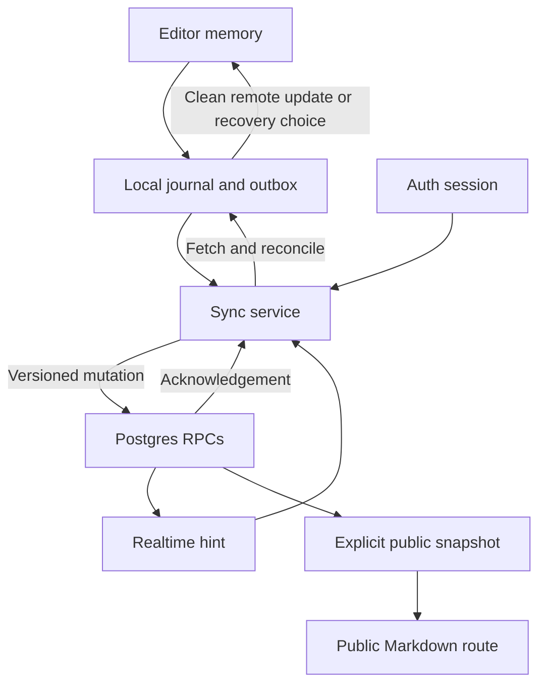

# AiryType — End-to-End Product and Implementation Plan

Version: 1.2  
Prepared: 12 September 2026  
Status: proposed implementation baseline; no application implementation is claimed  
Original input: `AIRYTYPE_RAW_KNOWLEDGE.md`, the initial consultation supplied by Yasir  
Revision input: `AIRYTYPE_ADVERSARIAL_REVIEW.md`, review of version 1.0  
Second revision input: `AIRYTYPE_ADVERSARIAL_REVIEW_2.md`, review of version 1.1  
Planning assumption: one founder, AI-assisted implementation, managed infrastructure

## 0. Read this first

**Build a writing experience worth returning to, then make it safe to trust with real writing.** These are separate engineering milestones. A polished editor is not yet a dependable notes service; a working database does not make an editor desirable.

The recommended first public release is a desktop-first, Markdown-source writing app with line/sentence focus, typewriter scrolling, folders, title/content search, portable export, accounts, fast background sync, recovery, and explicit Markdown publishing. Start with light mode and one font. Full offline availability, collaboration, attachments, dark mode, and font choices follow demonstrated demand.

The plan retains React, TypeScript, Vite, CodeMirror 6, Dexie/IndexedDB, Supabase, and Cloudflare, with a small snapshot-sync protocol. The sequence is **editor experiment → minimal local durability → thin secure cloud slice → daily workflow → safe private beta → public release**. Build folders, search and bulk portability once against the integrated model. Public Markdown publishing and a mobile read-only companion remain in public v1, but neither blocks the first real-data private beta.

Budget **approximately 300–470 focused implementation and active verification hours**, including contingency. At 20 focused hours/week, this is about 15–24 working weeks, not a launch-date commitment. Beta observation overlaps the remaining public-release work where practical; recruitment, waiting and any necessary follow-up observation can add elapsed time. The modest reduction from v1.0 comes from removing the complete local-only library and unnecessary migration prerequisite, not from discounting safety work. Re-estimate at G1 and G3 using actual editor and cloud evidence (§10).

For the product/build sequence, read §§2, 10 and 14 first. Use §3 when implementing the editor, §§5–6 for storage/sync, and §§12–13 for budget and launch readiness. The technical detail is an execution reference; it is not all work to do before the POC.

### 0.1 Evidence and inspection boundary

**Version 1.2:** read the supplied v1.1 plan and second review in full; the plan's SHA-256 matches the review's source hash. Incorporated six findings and two clarifications into existing contracts and gates. Checked selected primary Auth and Web Locks documentation. No repository inspection, application implementation, tests, deployment or recovery drill was performed; specification acceptance is not implementation evidence.

**Version 1.1 (historical):** both then-supplied files were read in full. That planning revision did not execute application code, deployment or a recovery drill, or reinspect the repository/raw consultation. Selected primary documentation was checked for database, browser-durability and restore details. The following observations remain historical evidence from v1.0:

- Read the supplied raw notes in full.
- Inspected the remote `main` branch of [yasir-mukhtar/airytype](https://github.com/yasir-mukhtar/airytype) at commit [`6075baae52c879f9eca1cd6634b6239f5fe13dc0`](https://github.com/yasir-mukhtar/airytype/commit/6075baae52c879f9eca1cd6634b6239f5fe13dc0).
- That snapshot contains repository housekeeping and 26 PNGs in `Ulysses Reference`; it has no application source, package manifest, database migrations, or test suite. No implementation phase can be marked complete from this snapshot. Local, unpushed work was not inspected.
- Visually inspected `Highlight options.png`, `Fixed scrolling feature.png`, and `Highlight feature - 5 - per sentence.png`. They confirm separate highlight and scrolling controls and sentence-level emphasis. Still images do not establish native timing, selection behavior, or IME behavior.
- Checked primary technical documentation for browser storage, sentence segmentation, editor APIs, Supabase permissions/realtime/backups, PostgreSQL search, Cloudflare hosting, and transactional email. Source links appear beside the decisions they inform.

### 0.2 How this remains durable

Keep this filename stable. Once adopted, commit it as `docs/AIRYTYPE_END_TO_END_PLAN.md`. Keep the raw notes as historical input, not competing implementation instructions. This deliverable has not been committed or pushed to the repository.

Separate the source of a decision from the evidence needed to release it. Original product requirements remain requirements; limits, defaults, retention, support and business choices introduced by this plan remain proposed baselines until adoption. Record material changes once in `docs/DECISIONS.md`; routine implementation does not need repeated approval.

| Evidence category | Examples | Decision rule |
| --- | --- | --- |
| Correctness invariant | Owner isolation; atomic base/ack handling; no silent overwrite; recoverable pending drafts; exact export | Must pass for the affected supported workflow. A founder cannot waive known writing loss or private-data exposure to meet a date. |
| Initial performance/operating target | Scheduling intervals, latency percentiles, cache size, anchor tolerance, load envelope, recovery time | Measure under declared conditions, tune within the same architecture, and record the reason. Missing a number is not automatically a correctness failure. |
| Product judgment | POC preference, beta size/duration, repeat-use signal, launch breadth | Founder decides from observed behavior and interviews. Small samples guide a decision; they do not prove demand or reliability. |

Each phase exit below combines relevant correctness evidence with reviewed targets and an explicit continuation decision. “Gate passed” never means every provisional number was met exactly. Scope commitments and server-enforced limits must agree with actual product behavior.

## 1. Decisions retained and corrected from Sol’s notes

| Topic | Decision for this plan | Reason |
| --- | --- | --- |
| Editor first | Retain the isolated editor POC | The differentiation must survive real writing before infrastructure earns its cost. |
| Markdown source | Retain CodeMirror 6 and a plain-text canonical body | Avoid a rich-text-to-Markdown conversion layer and lossy round trips. |
| Line focus | Define it as the **visible wrapped row** containing the caret | A newline-delimited Markdown paragraph can occupy many rows. Highlighting all of it would behave like paragraph focus. |
| Sentence focus | Retain `Intl.Segmenter`, with bounded Markdown context and explicit fallback | Segmentation is language-sensitive and imperfect; Markdown punctuation also needs handling. |
| Typewriter scroll | Make it event-driven, with one owner of scroll correction | Continuously forcing an anchor will fight selection, inspection, and browser scrolling. |
| Local storage | Add an acknowledged local journal before real note-taking | Debounced cloud saves and unload callbacks alone leave avoidable loss windows. |
| Fast sync | Measure local responsiveness separately from remote convergence | The internet cannot provide a universal millisecond end-to-end promise. |
| Concurrency | Retain snapshots without CRDTs, but require atomic version checks and durable conflict copies | One user can still edit on two devices or reopen a stale tab. |
| Realtime | Treat notifications as hints to fetch authoritative state | A live connection is not a durable synchronization log. |
| Recovery | Require trash, conflict preservation, basic checkpoints, safe deletion and one rehearsed restore route before real-data beta | Invited writers also need a trustworthy service. |
| Search | Start with literal case-insensitive search; add PostgreSQL trigram indexes only when profiling warrants it | Full-text search does not automatically satisfy partial words, mixed language, and literal punctuation. |
| Publishing | Publish an explicit snapshot, separate from the private draft | Later private edits must not silently become public. |
| Hosting | Use Cloudflare Workers Static Assets, adding a small Worker for dynamic routes | Keeps the SPA and eventual `.md` endpoint in one deployment. Pages remains a viable alternative if actual existing hosting appears. |
| Production cost | Plan for paid database reliability and operational extras | A small user count does not remove backup, email, staging, or support needs. |

## 2. Product contract and first-release boundary

### 2.1 Intended user and job

Initial audience hypothesis: people who regularly write notes, drafts, reflections, or articles in a desktop browser and value a calm writing environment and portable text. English and Indonesian prose are the initial behavioral test languages.

Core job: **open a note, enter sustained writing, find it again, continue on another computer, and leave with a usable Markdown file whenever needed.**

The product hypothesis is that focus and scrolling quality improve sustained writing enough to earn repeat use. This is unvalidated. During the POC, recruit five relevant writers, observe actual writing, and ask what would make them choose AiryType for the next draft. Do not infer demand from compliments on screenshots.

### 2.2 Release scope

| Capability | Editor POC | Private beta | First public release / later |
| --- | --- | --- | --- |
| Markdown source; selection/history; focus off/visible line/sentence; scrolling off/top/middle | Yes | Yes | Yes |
| Calm light appearance; one font; distraction-free layout | Minimal shell | Yes | Yes; dark mode/font choices later |
| Multiple notes, nested folders, title/content search, in-note find | No | Yes | Yes; ordering/advanced search later |
| `.md` import, single-note and complete-library export | No | Yes | Yes; other formats later |
| Verified signup, login, reset, logout, account deletion | No | Yes, invitation only | Yes, bounded public onboarding |
| Local journal, cloud persistence and same-user cross-device sync | No | Yes | Yes; full offline startup/collaboration later |
| Conflict copies, trash, basic checkpoints and a tested backup restore | No | Yes | Yes; elaborate history later |
| Public `.md` URL, explicit update and unpublish | No | Not required to open beta; opt-in testing after implementation | **Retained for public v1**; templates/custom domains later |
| Mobile companion | No commitment | Clear desktop-support message; no mobile writing promise | **Retain read-only browse/search/export where supported**; mobile writing later |
| Support, content-safe logs, incident controls | Session-only notice | Minimal working operation | Public help, capacity monitoring and launch operations |
| Attachments, AI, backlinks, tags, billing | No | No | Deferred; paid-launch branch in §13 |

Private beta means a few invited people may entrust real drafts to the product after G6. It is not public launch. “Launched” means a production product with public onboarding, the declared public-v1 features, support and the relevant safety evidence. A preview or an editor demo does not count.

Publishing and the mobile companion are removed only from the **beta dependency chain**, not silently from public scope. Deferral to product v1.1 is an explicit founder scope decision that updates this table, P7/P8, the estimate and §13 together. The default business model remains a bounded free public v1, without a promise of unlimited free service.

### 2.3 Support and capacity envelope

- **Writing support:** desktop Chrome, Edge, Firefox, and Safari on current stable versions; use the preceding stable version where practical in release checks. POC priority is macOS Chrome and actual Safari. Record exact versions in each gate’s evidence.
- **Mobile:** private beta may show a clear desktop-support message. The public-v1 companion provides account access, browse, read, search and export/share where the platform allows. Editing remains visibly unavailable until a separate input/viewport gate passes. Desktop zoom, accessibility magnification and narrow windows remain supported; width alone never determines writing eligibility.
- **Document format:** UTF-8 Markdown with LF line endings internally. Preserve whitespace, Markdown syntax, Unicode, and body content; do not normalize punctuation or rewrite imported prose. Invalid UTF-8 and NUL-containing imports receive an error before note creation. Document the CRLF-to-LF import normalization.
- **Launch limits:** 1 MiB UTF-8 cloud body per note; 1,000 active normal notes and 2,000 retained normal notes including trash; 100 active folders; three folder levels below root. Main text allowance: 50 MiB including normal notes, their trash and all published copies. Recovery notes have separate count/byte limits (§5.4). Title maximum 200 Unicode code points; folder names maximum 80. Empty titles display as “Untitled”; bodies may be empty.
- **Performance envelope:** 100,000-character normal test document; 500,000-character stress document if below the byte limit. Larger inputs fail gracefully rather than being truncated.
- **Creation and organization mutations** such as new notes, imports, moving, trashing, restoring, and publishing require a working connection to start in the cloud product. An interrupted import retains its staged work for retry. During an interruption, already loaded notes remain writable and journaled; do not promise access to uncached notes or reliable cold-start offline loading.
- **Oversized interactive edits:** reject an entire ordinary paste/insertion that would cross the per-note limit, leaving the prior draft and clipboard source intact; never insert a truncated prefix. During native IME composition, do not cancel or rewrite composition text. If its committed result is oversized, preserve the complete result locally and in export, pause cloud upload, explain the limit, and permit reduction/undo. Do not silently roll it back or acknowledge it as cloud-saved. The local journal can hold this temporary over-limit draft.
- **Account quota failure:** valid-size edits can remain locally saved even when the account is full. Preserve the pending draft and export; explain how to free space. This differs from an oversized body. Never truncate writing or prune conflict copies to satisfy a quota.

The limits protect a manageable launch envelope; they are not estimates of typical usage. Enforce relevant limits on the server as well as in the UI.

### 2.4 Success and non-negotiables

The first useful evidence is returning to write, not accumulating notes or sign-ups. Track writing on multiple days, the ability to resume a draft, and whether people understand where their writing is saved.

Non-negotiables: keystrokes never await a network request; acknowledged drafts are not silently overwritten; remote content never replaces a dirty draft; export remains available during sync trouble; private drafts never become public without a publish action; recovery and access control pass before launch.

## 3. Writing-experience specification

### 3.1 Visual and editing baseline

Use one self-hosted, openly licensed proportional font, with **Inter as the starting choice** and its license recorded before bundling. [Inter’s official site](https://rsms.me/inter/) supplies the font and license reference. Start testing at 20 px body text, approximately 1.7 line height, and 64–72 characters of comfortable line length. These are tuning values, not frozen pixel specifications. Use CSS tokens for surface, text, muted text, selection, focus, spacing, and editor width.

The writing surface takes priority over navigation. Desktop has a collapsible folder rail, note list, and editor. Distraction-free mode hides the first two without changing the note or remounting the editor. An accessible control restores them. Optional browser fullscreen is progressive enhancement; escape and ordinary browser controls must keep working.

Keep Markdown markers visible. Use restrained syntax styling for headings, emphasis, lists, links, and code. Heading treatment may differ by syntax, but focus on/off must never change font metrics or wrapping. Avoid live replacements, hidden markup, inline image rendering, automatic smart punctuation, and rich paste conversion at launch. Pasted rich content uses its plain-text representation.

Use a normal insertion caret first. Do not add a separately animated “smooth cursor” whose position trails actual input. Smoothness means responsive input and stable geometry.

Defaults: highlight off and fixed scrolling off. Make both independently discoverable; allow the founder to change these defaults after POC evidence. Persist preferences per browser after the persistence phase, not as competing cloud edits to the note. Provide a small appearance menu, accessible labels, and keyboard-operable controls.

### 3.2 Focus behavior

| State | Required behavior |
| --- | --- |
| Off | Normal readable text throughout. |
| Line | Emphasize the single visible wrapped row occupied by the collapsed caret. A source paragraph spanning six rows does not light all six. |
| Sentence | Emphasize the sentence containing the caret within its Markdown prose context, even when it wraps across rows. |
| Selection is non-empty | Temporarily suspend dimming so the whole selection and its surrounding text remain readable. Restore on a collapsed caret. |
| Editor loses focus / settings opened | Suspend dimming; do not move selection or scroll. Restore when editing resumes. |
| IME composition | Preserve the native composition UI; freeze focus decorations during composition and recompute after commit. |
| Caret outside the rendered viewport | Do not pull it into view just to calculate focus. Defer geometry until it becomes measurable. |

Line focus is a geometry feature. Use CodeMirror’s wrapped-line navigation and caret association, not `doc.lineAt(position)` alone. Read geometry after layout and verify wrap-boundary affinity. Do not derive character offsets by dividing pixels by an average character width. Bidi, combining characters, and surrogate pairs must never corrupt text; if a geometry case cannot be styled correctly, temporarily disable the effect for that case and record the limitation.

Sentence focus uses `Intl.Segmenter` with sentence granularity and a per-browser language setting (`English` or `Indonesian`, initialized from the browser locale with English fallback). This is a segmentation preference, not an AI language detector. The API provides locale-sensitive segmentation; it does not certify perfect sentence boundaries. [MDN: Intl.Segmenter](https://developer.mozilla.org/en-US/docs/Web/JavaScript/Reference/Global_Objects/Intl/Segmenter)

Segmentation contract:

- Work on the containing Markdown prose block. Headings, list items, and blockquotes bound context; never segment the entire note on every caret movement.
- Prefer a literal punctuation-safe context for inline links/code. Treat fenced code and non-prose table rows as line focus. In a URL, inline code, or Markdown link destination, use line fallback if parsing cannot produce a stable sentence range.
- A caret inside a sentence uses that sentence. At a shared boundary, use caret affinity; at document end, use the preceding sentence. Trailing whitespace remains with the preceding sentence until the next sentence begins. A blank line uses an empty-line/line fallback.
- Cap a context at 16,000 UTF-16 code units. For pathological larger prose blocks, use line fallback and a non-intrusive explanation in the appearance help. Do not introduce partial-window sentence guesses that flicker.
- Cache segment boundaries for unchanged context. Recompute when that context, language setting, or relevant syntax changes. Map results back to exact source offsets.
- Maintain fixtures for `Dr.`, `Mr.`, `dll.`, `dsb.`, `Rp.`, decimals, ellipses, quotes, emoji, URLs, and mixed English/Indonesian. Small boundary differences between browsers are acceptable if text stays intact and transitions remain usable; persistent everyday failures reopen this decision.

### 3.3 Dimming and accessibility

Use a controlled text-color treatment, not opacity on the entire editor. Selection, caret, IME text, controls, and syntax combinations must remain legible. Measure the actual computed colors, including nested syntax spans. Target at least 4.5:1 for ordinary readable text, including surrounding text in focus mode. The reference screenshots’ strong fading is inspiration, not the accessibility target. [W3C: contrast minimum](https://www.w3.org/WAI/WCAG22/Understanding/contrast-minimum.html)

Respect reduced motion and forced colors. In forced colors, prefer normal text plus a restrained active indicator. Do not hide non-active text from assistive technology or create a second hidden copy of the document. Test keyboard-only operation, VoiceOver with Safari, and a Windows screen-reader/browser combination before claiming accessibility support.

### 3.4 Fixed/typewriter scrolling

Anchors are measured inside the **usable editor viewport**, excluding app chrome: top = 25%; middle = 50%. Align to the caret rectangle’s vertical center. Keep sufficient leading and trailing padding for the first and last rows to reach the anchor; recompute it on viewport changes without changing the document text.

| Event | Scroll behavior |
| --- | --- |
| Ordinary insertion, Enter, Backspace/Delete | Correct toward the chosen anchor after input/layout, when the caret is collapsed and composition is inactive. |
| Paste, cut, undo, redo, formatting command | One correction after the completed action and stable selection; not one correction per internal transaction. |
| Wheel, trackpad momentum, scrollbar drag, touch scroll | Cancel queued anchor correction and permit inspection. The next intentional text edit can re-engage anchoring. Do not snap back on a timer. |
| Mouse click, drag selection, Shift-selection | Normal selection and minimal native visibility scrolling. No anchor correction. |
| Arrow keys, Home/End, Page Up/Down | Normal navigation. Focus follows the caret, but fixed anchoring waits for text input. |
| IME start/update | No AiryType-driven scroll correction. After composition ends, wait for the final editor transaction and layout, then correct once. |
| Find result, open note, clean remote replacement | Reveal the relevant selection normally. No automatic anchor movement until typing resumes. |
| Change anchor setting | One deliberate alignment if the editor has a collapsed, measurable caret. |
| Resize, font load, zoom, hide/show sidebars | Re-measure padding/focus. Do not forcibly re-anchor an inspection position. |

Implementation rules:

1. Own scrolling in one CodeMirror extension. Classify transactions by origin: local input, history, external content, or selection/navigation.
2. Schedule geometry reads through `requestMeasure`; use a matching write phase. Use `scrollIntoView`/`scrollHandler` where appropriate so default reveal and custom anchoring do not produce two visible scrolls. Never dispatch a document update from a scroll handler.
3. Cancel stale measurement results when note, selection, mode, or user scroll intent changes. Use a small deadband, initially 2 CSS px, to avoid fractional-pixel oscillation.
4. Apply instant small corrections. For the initial release, use no queued smooth-scroll animation per keystroke. Large re-entry movement should finish predictably in one correction; later animation requires separate evidence.
5. If caret coordinates are unavailable, let CodeMirror reveal the caret, then re-measure once. Do not loop until success or scan virtualized DOM as if it were the whole document.

CodeMirror’s public APIs include layout scheduling, wrapped-boundary movement, and scroll overrides. Verify their signatures against the installed packages during Phase 0. The inspected GitHub mirror is archived and its README points to the maintainer’s new repository; archival alone is not evidence that CodeMirror is abandoned. The current maintainer host and the reference site were inaccessible to this research session. [EditorView source](https://github.com/codemirror/view/blob/main/src/editorview.ts), [repository relocation notice](https://github.com/codemirror/view/blob/main/README.md)

### 3.5 POC evidence and continuation decision

**Correctness:** exercise all nine focus/scroll combinations. Text remains intact; ordinary editing, undo, selection, manual inspection and native composition work without recurrent caret jumps or scroll fights. Test actual Safari and native IME input. A visible-row fallback must not be relabeled a successful visible-row implementation.

**Measured targets:** record editor-only responsiveness against §9; repeat with persistence enabled in P2/P3. Pixel tolerances and timing budgets can change with observed usability and hardware evidence.

**Product judgment:** aim for three founder sessions of about 30 minutes, including long wrapped prose and substantial selection/undo. Seek around five target-writer trials with disposable text and the session-only notice. Three people wanting to use it for another draft is a useful initial signal, not a mandatory vote count. Record what people actually did and the founder's decision; recruiting delays alone need not block P2.

If writing is unpleasant, timebox one focused remediation pass before expanding infrastructure. If geometry still requires brittle DOM hacks or serious input failures remain, revisit the editor/interaction decision. Further polish should follow a concrete observed problem.

## 4. System architecture and module boundaries

| Layer | Choice | Responsibility |
| --- | --- | --- |
| App shell | React + TypeScript + Vite | Navigation, dialogs, note list, settings, accounts; does not own the live document on every keystroke. |
| Writing engine | CodeMirror 6 + Markdown language support | Document, selection, history, focus decorations, scroll behavior, editor commands. |
| Local durability | IndexedDB through Dexie | Recoverable drafts, acknowledged server snapshots, durable pending mutations, conflict copies. |
| Sync service | Small TypeScript module, outside React rendering | Queueing, immutable in-flight requests, retries, reconciliation, status, conflict preservation. |
| Managed backend | Supabase Postgres + Auth + Realtime | Identity, authoritative accepted versions, permission enforcement, atomic mutations, change hints. |
| Web hosting | Cloudflare Workers Static Assets | Static app and landing/help pages. |
| Narrow HTTP routes | Cloudflare Worker | Retryable account/permanent-note deletion in P6; public Markdown delivery in P7. No general editor or WebSocket server. |
| Transactional email | Supabase Auth using dedicated SMTP, initially Resend | Verification and recovery messages; actual delivery tested before external onboarding. |
| Verification | Vitest + Playwright + SQL integration tests | Pure rules, browser behavior, and actual database isolation/concurrency. |

Cloudflare documents a static-assets deployment with selective Worker-first routes. Configure `/api/*` when deletion ships and reserve `/p/*` for publishing; before publishing is enabled it returns an error. Unknown Markdown URLs must never return the SPA’s `index.html`. [Cloudflare: Static Assets](https://developers.cloudflare.com/workers/static-assets/)



### 4.1 Concrete code organization

Keep a single repository and one application package. Start with `src/editor/`, `src/app/`, and the POC fixture directory. Add other modules only when their phase begins:

| Path | Boundary |
| --- | --- |
| `src/editor/` | `createEditor`, theme, focus-range calculation, focus decorations, typewriter extension, transaction-origin annotations. |
| `src/features/notes/`, `folders/`, `search/` | Feature UI and user commands. |
| `src/storage/` | Dexie schema, local transactions, migrations, repository API. |
| `src/sync/` | Pure state transitions, scheduling, transport adapter, reconciliation and conflict handling. |
| `src/auth/` | Session lifecycle and account namespace transitions. |
| `src/export/` | Markdown normalization, safe filenames, archive manifest/import. |
| `worker/` | The few dynamic HTTP handlers and server-only configuration. |
| `supabase/migrations/` | Version-controlled schema, policies, RPCs, indexes and cleanup jobs. |
| `tests/fixtures/`, `tests/e2e/`, `tests/db/` | Curated editor fixtures, browser scenarios and database guarantees. |
| `docs/` | This plan, current status, decisions and actual verification evidence. |

Use typed modules and explicit interfaces; no generalized event bus, plugin marketplace, monorepo orchestrator, or speculative adapter framework. The local repository interface should survive the move to cloud sync without replacing the editor.

### 4.2 Editor ownership rules

- Create one `EditorView` for the active editor surface. Do not mirror its entire body through controlled React props on every input, or recreate it when a toolbar preference changes.
- Use CodeMirror compartments for configuration changes. Keep range calculations testable separately from DOM styling and scroll geometry.
- Export document changes to the persistence adapter; sync status comes back independently. A save response is never an instruction to overwrite current editor memory.
- Restore note selection and viewport on navigation. Keep a small bounded in-memory cache of recently opened editor states; session undo is useful, but persistent undo across browser restarts is not promised.
- A clean remote content replacement is an explicitly annotated transaction, excluded from ordinary local undo. Preserve/map a sensible caret and avoid recentering. Clear or rebase obsolete undo state deliberately, with a checkpoint as recovery; never let Undo silently revert another device’s accepted update.
- Avoid whole-document segmentation, full DOM scans, and rebuilding decorations unrelated to the changed context. Use CodeMirror’s visible ranges and geometry changes to scope work.

## 5. Data model and mutation boundary

Markdown remains text in Postgres. There is no object-storage dependency for note bodies and no physical server folder tree. One `.md` file is produced from a note at export time.

### 5.1 Server entities

This is a logical schema to implement in migrations, not executable SQL.

| Entity | Essential fields and constraints |
| --- | --- |
| `accounts` | `user_id` tied to Auth, lifecycle status, quota counters, timestamps. Its row provides an account-scoped transaction lock for mutations that affect quotas or organization. |
| `service_state` | Dataset epoch, minimum compatible protocol, separate read/write availability. Admin-write-only. Policies and RPCs check it; restore quarantine also uses controls outside the restored database (§6.5). |
| `folders` | UUID `id`, `user_id`, nullable `parent_id`, `name`, integer `version`, server timestamps, `deleted_at`. Same-owner parent relationship; validated depth and no cycles. |
| `notes` | UUID `id`, `user_id`, nullable `folder_id`, `title`, `kind` (`normal` or `recovery`), integer `version`, body byte count, server timestamps, `deleted_at`, purge state. Metadata only. |
| `note_contents` | One-to-one note ID, `user_id`, Markdown `body`. Written atomically with its note metadata. |
| `mutation_receipts` | Unique `(user_id, mutation_id)`, request digest, compact outcome/version references, completion time; no echoed bodies. Successful retries return the original result. Retain seven days; index for replay and bounded cleanup. |
| `deletion_operations` | Stable operation ID, owner/target ID, intent time and progress through receipt/cleanup/completion. Minimal retry state for the existing Worker, not a general job system. Completed account cleanup need not retain an Auth-linked row; the external receipt survives. |
| `note_revisions` | Owner/note, source version, title/body/folder snapshot, reason, server creation time. Bounded recovery checkpoints, not a copy of every autosave. |
| `publications` | Owner, source note/version, random token, explicitly published title/body snapshot, publication version, timestamps, active/revoked state. Separate from the private working body. |

Splitting metadata from bodies keeps lists and Realtime events small. Read each comparison snapshot—body, title, folder, version, deletion state and epoch—from **one joined SQL statement**. The same rule applies to export/checkpoint reads and publication copying; a single RPC containing separate Read Committed queries is insufficient because those queries can see different commits. No global isolation-level increase is needed. [PostgreSQL transaction isolation](https://www.postgresql.org/docs/current/transaction-iso.html)

Only note/folder metadata belongs in the private Realtime publication. Configure that database publication with `publish = 'insert, update'`; exclude physical deletes and truncates at the server publication, not just in the normal client subscription. Use logical deletion updates for sync. Verify the chosen Supabase project permits and retains this configuration, which affects all tables in that publication. Bodies, revisions, receipts and publication contents stay out. If this setting cannot be proven, keep Realtime disabled and use reconciliation with a disclosed slower target until resolved. Supabase documents that delete events do not use ordinary RLS authorization. [Supabase Postgres Changes](https://supabase.com/docs/guides/realtime/postgres-changes), [PostgreSQL publication configuration](https://www.postgresql.org/docs/current/sql-alterpublication.html)

IDs are client-generated UUIDs so local drafts and retries have stable identities. Entity versions are assigned on the server and increase on all accepted body, title, folder, delete, or restore changes. Do not use device clocks or `updated_at` to decide who wins. Serialize database `bigint` values safely as decimal strings if they can exceed JavaScript’s exact integer range.

### 5.2 Server-enforced invariants

- Derive the acting owner from the authenticated session, never a trusted request `user_id`.
- Every private read checks owner, verified account/lifecycle and read availability, including direct table reads and Realtime authorization. Centralize that policy without creating recursive RLS dependencies. Test two actual user sessions and anonymous requests. Supabase’s RLS mechanism is the isolation boundary for exposed private table reads; RPCs also enforce their own shared contract. [Supabase: Row Level Security](https://supabase.com/docs/guides/database/postgres/row-level-security)
- Use narrow RPCs for create/save/trash/restore/recover note and folder changes, plus owner-scoped manifest/note/search/export reads. Add publish/update/unpublish in P7. Permanent deletion goes through the Worker orchestration in §6.5; ordinary clients cannot bypass the external-receipt step with a purge RPC. Avoid a generic “upsert anything” endpoint.
- Deny ordinary authenticated clients direct table writes. For mutation RPCs that need to write despite those grants, use narrowly scoped `SECURITY DEFINER` functions with explicit owner checks, schema-qualified names, a fixed empty `search_path`, and restricted execution grants. Prefer an appropriately restricted owner role; treat each definer function as security-critical. RLS must not be assumed to protect a definer function automatically. [Supabase: Database Functions](https://supabase.com/docs/guides/database/functions)
- All ordinary mutations share one contract: authenticated and verified actor; supported protocol and current epoch; writes enabled; active account; authorized target; valid expected version, relations, size and quota; applicable rate limit. Check again under the account row lock where races matter, including lifecycle and receipt replay. Centralize these checks with narrow internal helpers. Consistent lock ordering serializes one user’s writes briefly, not all users. Privileged deletion/restore helpers have explicit restricted exceptions; browser callers cannot invoke them.
- An exact successful receipt replay rechecks present authorization, lifecycle and epoch, but does not require its old expected version to still match or charge its quota again. Apply CAS and new-state quota checks only when executing a new mutation. Otherwise a lost acknowledgement could turn an accepted save into a false conflict.
- A note can only belong to a live folder owned by the same account. Concurrent folder moves cannot create cycles. The account lock makes checking a whole subtree’s resulting depth meaningful under concurrent requests.
- Folder deletion is allowed only when it has no live children or notes. Give the user a move-out flow. No recursive cascade-delete UI in v1.
- Normal note creation has an explicit “expected absent” condition. Updates to missing or tombstoned notes cannot become creates. Never use `ON CONFLICT DO UPDATE` as a substitute for version checking.
- Trash is a versioned soft delete and revokes any publication in the same transaction. Purging removes title/body/revisions and leaves only entity type, ID, owner ID, final version and deletion/purge timestamps until account deletion. Folder tombstones likewise drop the name and hierarchy. Purged IDs cannot be recreated. Retention purge follows the receipt-backed deletion path (§6.5); tombstones count toward manifest capacity, not text allowances.
- All mutations are size-checked, quota-checked and rate-limited per account on the server. Failed requests leave database state unchanged.

Do not distribute service-role credentials to the SPA. The Worker’s public reader should call a narrowly scoped anonymous publication-read RPC with an unguessable token; it does not need general private-note access. The privileged deletion handler uses a separate server-only secret and independently verifies the requester.

### 5.3 Local records

Namespace everything by authenticated user ID. Use separate records for the last acknowledged server snapshot, current draft, immutable in-flight request, and recoveries. Include `note_id`, `writer_id`, local generation, base server version, body/title, and persistence state where applicable. A local generation is a monotonic counter for this writer, not a server version.

Dexie transactions keep a saved draft and its pending-sync intent together. An IndexedDB transaction cannot include the eventual HTTP request; that is why retries and receipts are necessary. Dexie documents transactional local writes and schema upgrades. [Dexie: Design](https://dexie.org/docs/Tutorial/Design)

Use one exclusive Web Lock with the constant application name `airytype:writer` per browser origin, **independent of account ID**. Account/session identity lives inside its coordinator. Its holder alone mutates drafts/outbox/base/cache records, sends uploads, applies acknowledgements, reconciles persistent state and performs handover or account cleanup. Secondary tabs are read-only until they acquire ownership; they can read snapshots and request open/refresh/handover/logout through a small `BroadcastChannel`, but cannot independently drain or clear records. Scope messages by account/session and send control metadata, not draft bodies. Serialize logout/account switching through this same origin-wide lock; do not start a second account writer until the transition completes.

Cooperative handover, if provided, settles local commits and fences the old writer before releasing ownership; it does not wait for cloud availability. A new holder acquires the lock, reloads durable pending/sealed work and gets a fresh writer/session token before sending anything. Never steal a live lock on timeout. A frozen owner produces an actionable read-only explanation: return to/resume the writing tab to settle work; ownership cannot transfer until it resumes or closes. Closing may lose memory-only edits and is not advertised as lossless. Browser termination releases the lock. A clearly explained single-writing-tab policy is sufficient if cooperative handover proves costly; do not add leases, timeout stealing, a SharedWorker or another election mechanism. Unsupported environments receive a clear writing-compatibility limitation. Keep `writer_id` because the lock does not coordinate separate browsers/devices. [MDN: Web Locks API](https://developer.mozilla.org/en-US/docs/Web/API/Web_Locks_API), [Web Locks resource names](https://w3c.github.io/web-locks/#resource-names)

Cache all bounded note metadata and recently opened bodies. Use an initial 20 MiB LRU budget for **clean** cached bodies. Pending drafts, in-flight requests, unresolved recoveries and prior-epoch copies awaiting comparison/preservation (§6.3) are never LRU-evicted. Cache pressure must not masquerade as successful persistence.

### 5.4 Quota and retained-state accounting

These are initial product capacity baselines; enforce the adopted values atomically on the server. Renaming or moving a note never changes its accounting class.

| Retained state | Accounting rule |
| --- | --- |
| Normal notes | At most 1,000 active and 2,000 active-plus-trashed. Their bodies, normal trash and all published snapshots share 50 MiB. Trash keeps its bytes/count until purge. |
| Recovery notes | At most 200 active-plus-trashed copies and 10 MiB total, outside normal limits. Only the validated conflict/recovery RPC assigns this class; a caller-supplied `kind` cannot grant extra capacity. A restore-as-copy may use this same guarded path. |
| Promoted recovery | Explicit conversion to normal in one checked transaction: charge normal count/bytes, then release recovery allowance. If normal quota is full, keep the recovery unchanged. Editing, moving or choosing “keep both” does not auto-promote it. |
| Checkpoints | Separate 100 MiB account budget and per-note time/count retention (§6.5); never silently substitute checkpoint pruning for saving current writing. |
| Tombstones | Minimal content-free records retained for stale-device safety; accrue with lifetime churn. Account for note and folder tombstones, regardless of active count. |
| Mutation/deletion receipts | Account for rows, indexes and cleanup workload. Ordinary mutation receipts expire after seven days; deletion intents remain retryable until complete and external receipts follow backup retention (§6.5). |

Exhausting normal or recovery quota preserves local writing and export. Do not silently delete recoveries, change note kinds, or advertise an unsynced copy as cloud-saved. Rate limits also apply to recovery creation.

At G4, prove a complete manifest at 1,000 live normal notes + 1,000 trashed normal notes + 200 retained recoveries + 100 folders + 5,000 accumulated note/folder tombstones, within the byte budgets. Test actual JSON bytes, item counts, response limits and latency; a 1,000-note test alone is insufficient. Initially trigger capacity work at **2 MiB serialized metadata or 10,000 manifest entries**, with an alert before that point. Tune this threshold only against tested response limits. If an account approaches it, pause new entity creation for that account until capacity is raised safely or manifest pagination is added; existing writing, deletion and export continue. Do not truncate results or garbage-collect tombstones to hide the problem. Simple tested pagination is the next step if needed, not a new change-log service.

## 6. Persistence, sync, and recovery protocol

This section is the shared safety contract. Implement its cases at their named phases: core write/read correctness in P3, complete reconciliation in P4, and real-data recovery operations by G6. It is not a prerequisite to implement everything before the editor experiment. CAS below means “accept this save only if the server still has the version I edited.” An outbox is a durable list of pending work. Neither requires a CRDT.

### 6.1 Meaning of save status

| User-facing status | Exact meaning |
| --- | --- |
| Saving on this device… | Latest editor generation has not yet received a successful local transaction acknowledgement. |
| Saved on this device · Syncing… | Latest generation is in IndexedDB; the server has not acknowledged it yet. |
| Synced | Latest generation has a successful server acknowledgement; there are no unresolved local or remote changes for this note. It does not certify that a sleeping device has fetched it. |
| Saved on this device · Offline | Local acknowledgement succeeded; remote delivery is pending. |
| Sign in to resume sync | Keep the account’s pending drafts; require the same account to reauthenticate before upload. |
| Two versions preserved | State whether the recovery is saved on this device or in the cloud; link to it and explain which note remains the server original. |
| Checking latest version… | A clean cached note is displayed; normal online editing waits for a freshness read. Offer an explicit saved-copy choice if the check stalls. |
| Couldn’t save on this device | Local commit failed. Keep memory intact, expose Download/Copy immediately, and do not show a saved indicator. |
| Cloud storage limit reached | Keep the local draft and export working; explain how to free space or retry. |

Rate-limit status announcements for assistive technology and avoid flickering the UI on every keystroke. Quiet presentation must not conceal a persistent failure.

Journal transactions request `strict` durability where the pinned Dexie/browser path supports it; otherwise use the documented browser default and record the effective hint. Dexie exposes `chromeTransactionDurability`; verify actual transaction behavior in P2 rather than assuming the option gives every browser the same guarantee. Await transaction completion, not an optimistic live-query update, before acknowledging a generation. Strict is a browser durability hint, not an unconditional promise against power loss. [IndexedDB durability specification](https://w3c.github.io/IndexedDB/#transaction-durability-hint), [Dexie constructor options](https://dexie.org/docs/Dexie/Dexie)

IndexedDB is not an unconditional backup. Best-effort browser data can be evicted, and a user can clear it. Request persistent storage at an appropriate post-engagement point and handle denial; cloud acknowledgements and exports remain separate protections. [MDN: storage quotas and eviction](https://developer.mozilla.org/en-US/docs/Web/API/Storage_API/Storage_quotas_and_eviction_criteria)

### 6.2 Local-to-cloud write path

1. Apply the user’s change immediately in CodeMirror memory. Increment that writer’s local generation.
2. Persist the latest draft and pending-sync intent together. The coordinator permits **one active draft-write transaction and one coalesced latest pending generation per dirty note**; repeated edits replace that pending snapshot, not append writes. Start an idle writer after an initial target of at most 100 ms while active; slow commits can exceed it without creating a per-keystroke backlog. Schedule across dirty notes fairly and persist before switching/handover. Acknowledge only the exact committed generation. Do not rewrite native composition text.
3. Cloud scheduling starts only from a locally committed draft. Begin with a 750 ms idle debounce, a two-second maximum wait during continuous input, and normally at most one snapshot commit per note per two seconds. Flush at deliberate note switches when possible; do not block the typing loop.
4. Before transmission, persist a sealed request containing `dataset_epoch`, protocol version, `mutation_id`, `note_id`, `expected_version`, local generation, and exact intended title/body/folder state. Its contents and ID are immutable after the first send.
5. Keep at most one in-flight mutation per note. Permit a small global concurrency, initially two requests, so importing notes does not starve the active note. Prioritize active editing; coalesce unsent draft generations, never an already-sent request.
6. Apply the shared mutation contract (§5.2) and check the receipt under the account lock; an optional fast lookup never bypasses current lifecycle/epoch checks. Reject a reused mutation ID with a different digest. A valid exact retry returns its recorded acknowledgement without another update.
7. If the expected version matches, validate ownership, sizes, quota and folder state; write body and metadata together, increment the version, create any due checkpoint, and record the receipt in the same transaction. Return a compact acknowledgement with accepted identity/version and any canonical metadata changed by the declared recovery fallback (such as root folder); no full echoed body is needed.
8. If the version does not match, return a typed conflict with the current entity reference/version. Do not update either version. The client fetches a consistent server snapshot and preserves its own draft.
9. In **one local transaction**, store the accepted base from the sealed body plus acknowledged canonical metadata/version, remove only its exact replay record and update pending state. Validate account/session/writer/identity/epoch tokens before applying the callback. Never delete the only replay record before the accepted base is stored. Propagate acknowledged recovery folder/title corrections into corresponding fields of newer pending generations only where those fields have not been independently edited since the sealed generation; preserve independently changed fields and all newer body text. Never rewrite the sealed request. Mark clean only if that acknowledged generation is still current; newer typing stays pending, based on the accepted version. If a newer remote version is known, reconcile before showing Synced. A local ack-application failure keeps the request retryable.

Example: generation 41 is sent, generation 42 is typed, then the reply for 41 arrives. The base version advances, but generation 42 remains dirty. Replacing the editor with generation 41, or clearing the outbox unconditionally, would lose writing.

Timeouts and dropped acknowledgements retry the exact request ID with exponential backoff and jitter, capped initially at 30 seconds. Respect server retry guidance. Authentication failures pause for reauthentication; validation, size, and quota errors require a visible remedy, not an infinite retry loop. If a receipt has aged out, ordinary version/existence checks still prevent blind replay; a redundant recovery copy is preferable to an overwrite.

Measure sustained typing with local persistence enabled, including slow commits and near-limit bodies. At 1 MiB, ten full draft snapshots/second would move roughly 10 MiB/second of body payload through the application/storage boundary before cloning; this is a workload calculation, not measured disk traffic. Keep full snapshots and bounded scheduling initially. An incremental log or worker is justified only by measured failure of this approach.

Use `visibilitychange` and `pagehide` as best-effort prompts to persist/flush. `beforeunload`, `sendBeacon`, and keepalive requests are not the durability boundary. Browsers may terminate without a reliable final callback. [MDN: beforeunload limitations](https://developer.mozilla.org/en-US/docs/Web/API/Window/beforeunload_event)

### 6.3 Remote changes and reconciliation

Subscribe only to owner-authorized note/folder metadata. A Realtime hint identifies an entity that may have changed. Fetch its current version/body as needed; compare epochs first, ignore stale versions only within the same epoch, coalesce bursts, and identify the client’s own acknowledged mutations.

**Epoch transition:** at startup/reconnect, check the current epoch before normal version ordering, replay or clean-cache replacement/eviction. On a changed epoch, the existing coordinator durably protects available prior-epoch bodies/base snapshots, including clean **Synced** copies, alongside dirty drafts and sealed requests; fence old-epoch callbacks. Compare whole canonical title/body/folder/lifecycle state against the fresh dataset. Equal copies may adopt the new base; unequal copies remain labeled **device copies**, without assuming they are newer, and must remain recoverable before adopting restored server state. A locally known note missing on the server remains a device copy; do not replay its old create or recreate its old ID. Reuse §6.4's deliberate recovery under a new UUID, allowance handling and local export. Keep transition/protection state across restart and release protected bytes only after safe preservation or explicit discard. A full recovery allowance leaves copies protected locally. This covers available device data, not uncached writing or a smaller disaster RPO. Endpoint changes and missing Auth identities follow §§6.5–6.6.

Use `list_manifest` to return one JSON object containing epoch, notes/folders/tombstones and explicit per-kind counts, built by a **single SQL statement**. It contains no bodies. Verify that this scalar/single-row RPC shape returns the entire nested manifest through the deployed API; do not assume its outer-row shape removes payload limits. Test counts and bytes against §5.4 and actual API configuration. A complete manifest is simpler than a resumable change log at this envelope.

Reconcile after subscription establishment, initial sign-in, reconnect, return to foreground, and a 60-second interval while the app is visible. Establish the subscription before the initial manifest fetch, then reconcile hints that arrive during the fetch. Notifications can be duplicated, reordered or missed without determining correctness. Supabase documents authorization and throughput considerations for Postgres Changes; measure fan-out against the actual usage model. [Supabase: Postgres Changes](https://supabase.com/docs/guides/realtime/postgres-changes)

Fetch the complete comparison snapshot with the joined SQL statement in §5.1. If the server has advanced beyond the manifest version, compare against the newer whole snapshot. Recheck local generation, dirty/composition state and session/identity tokens after the asynchronous fetch, immediately before an atomic local apply.

**Freshness on opening/resuming a clean cloud note:** display cached content immediately as checking/read-only, then fetch its current snapshot before enabling ordinary online editing. Apply this after sign-in, clean-note open, reconnect and return from suspension. Do not buffer keystrokes invisibly or replay them against text the user has not seen. If the check takes around two seconds or the connection is unavailable, expose “Continue from this device's saved copy” and explain that another device may have a newer version. That explicit choice uses the normal conflict-preserving path. This is a freshness check, not a distributed edit lease.

Already-active or dirty writing continues through a network interruption; do not freeze it every time connectivity changes or a poll runs. Resume/reconcile dirty drafts without replacing them. A healthy sequential A-to-B handoff should not routinely create recovery copies; genuinely concurrent writing can still do so.

Remote-update rules:

- Clean, non-composing editor: persist the fetched snapshot and apply one annotated update, with sensible caret mapping and no fixed-scroll jump.
- Dirty draft or pending request: keep local text; perform reconciliation before any overwrite. Let exact acknowledgement/receipt logic settle an in-flight request where possible.
- Active composition: queue remote presentation until composition completes; compare again because the final composition may make the note dirty.
- Remote deletion: show that the original note was moved to trash. Preserve local edits as a recovery candidate; never undelete merely because an old device reconnects.
- Unopened note: update metadata and invalidate stale clean cache. Do not download the entire library’s bodies on each connection or event.
- Missing server entity: an update fails as missing/deleted. It never silently becomes a fresh note with the same ID.

Manifest completeness includes trash, recovery records, folders and tombstones. Use the tested capacity trigger in §5.4, monitor bytes/query time, and never treat a partial or oversized failed response as an empty/complete library. Physical purge notifications are unnecessary: logical states plus authoritative reconciliation determine sync.

### 6.4 Conflict policy: preserve both, do not guess

Settle a known in-flight request through exact receipt/replay logic first where possible. Compare full canonical title/body/folder/lifecycle state, not body alone. If the latest local snapshot equals the server snapshot, atomically update accepted base and exact pending records; a rechecked newer generation remains dirty. Equality never clears unrelated work.

For genuine divergence, the existing coordinator performs one identity transition:

1. Stop new pushes to the original. Persist a transition with original ID/base, fetched server alternative, one stable recovery UUID and the latest captured generation. Serialize this boundary with local editor changes. If composition is active, preserve it and defer the cutover until commit.
2. In the **same local transaction**, create the recovery draft, reassign pending unsent work, and store an original-to-recovery redirect. Fence/retire old-identity callbacks; retain any unresolved original request for exact receipt settlement, without letting its result mutate the recovery. The redirect makes restart deterministic: before commit the original draft remains recoverable; after commit every later generation belongs to the recovery UUID.
3. Keep the editor on the user's text. Edits arriving while the transaction completes stay in the coordinator's latest pending draft and follow the serialized redirect; never persist them back under the original ID. If the transaction fails, preserve the prior draft/intent and current memory, keep pushes paused, and expose export. Do not claim a successful cutover.
4. Only after the local cutover commits, seal an idempotent recovery-create request for a captured generation. Subsequent typing follows normal generations under the same recovery ID. A delayed create acknowledgement advances only that generation; retry after a lost acknowledgement reuses the sealed request and recovery UUID. No second queue is introduced.
5. Keep the accepted server note as the original. Default the recovered copy to the previous folder if still live/owned, otherwise root; recheck this in the server transaction. Shorten the source title by Unicode code points to fit the generated recovery suffix within 200. Apply these acknowledged corrections to the accepted base and unchanged corresponding fields in newer pending generations (§6.2 step 9), so subsequent saves do not reuse the rejected folder/title. Neither a deleted folder nor a long title may prevent body preservation.
6. Offer open original, keep both or copy text across. Removal is a separate deliberate action. Apply the 200-copy/10 MiB recovery allowance in §5.4. If exhausted, retain and label the local recovery, keep export, and never say both copies are cloud-saved. No automatic merge or graphical merge editor in v1.

The recovery test keeps typing while creation is delayed, crashes immediately before/after local cutover, loses the server acknowledgement and delivers stale original callbacks. Include a deleted-folder root fallback: type a newer generation during delayed creation, apply the canonical metadata and save again successfully; independently edited fields remain intact. Every locally acknowledged sentinel generation must survive in the correct draft/original/recovery. Unacknowledged memory-only edits retain the ordinary browser-crash limitation; the test must not imply a stronger promise.

Concurrent rename/move/delete conflicts fail visibly. Refresh accepted organization state while preserving body drafts; let the user retry. User-initiated organization requires a connection. Automatic recovery can be prepared locally during an interruption and uploaded later without turning folder operations into an offline merge protocol.

### 6.5 Recovery layers, deletion and disaster recovery

| Layer | Initial policy | Purpose/limit |
| --- | --- | --- |
| Live undo | Current session plus a bounded recent-note state cache | Immediate mistakes; not persistent history. |
| Local draft/outbox | Until safely acknowledged or deliberately discarded after an explicit choice | Interrupted uploads and browser-session recovery; browser storage is not an unconditional backup. |
| Recovery notes | Until deliberately removed; count/byte allowance in §5.4 | Divergent or stale writing. Never auto-prune them to meet quota. |
| Trash | Keep current body 30 days; explicit permanent deletion available | Accidental deletion. Trash continues consuming its original quota class. |
| Server checkpoints | At most one routine pre-change point per 30 minutes of editing, plus pre-delete/pre-restore points; at most ten/note and seven days | Sparse available recovery points, not a guarantee of the last 30 minutes of edits. |
| Checkpoint budget | 100 MiB/account; deduplicate versions and prune oldest points first | Bounds history without deleting current writing. |
| Backups by real-data beta | Paid daily provider backups plus one daily encrypted independent logical export; seven-day window | The independent logical export is the **primary rehearsed restore source**; provider backups are an additional copy, not a second required recovery program. |

Offer a small earlier-version list with time, preview and **Restore as a new note**. Use a live original folder or root, enforce generated title limits, and never overwrite the present draft. Apply the guarded recovery allowance when restoring as a recovery copy. Verify this after closing/reopening the editor, when session undo is gone. Retention by count, time and bytes can leave fewer recovery points than a user expects; explain it plainly.

The v1.0 pricing research recorded seven days of daily backups on Supabase Pro; confirm the selected project's actual plan and backup schedule before beta. [Supabase backups](https://supabase.com/docs/guides/platform/backups)

Initial operating targets: **RPO up to 24 hours** of accepted server changes for total server loss, assuming a healthy daily backup, and **RTO eight hours after incident response starts**. Record actual drill timing and the latest successful backup; an overdue job worsens RPO and must alert. No zero-loss disaster or 24/7 human-response promise. A smaller disaster loss window requires a separately funded PITR decision.

**One retryable deletion sequence.** The existing Worker handles both account deletion and permanent-note deletion; use the same route for scheduled trash purge. Use a small `deletion_operations` record and one operation ID throughout:

1. Verify the requester (recent reauthentication for account deletion), lock the account/target, record intent and block relevant writes/access; revoke publications atomically. Account deletion hides all private data and prevents new sessions from regaining application access. A purging note no longer serves bodies/revisions. Internal cleanup can proceed under restricted credentials.
2. Persist an encrypted external deletion receipt containing only operation ID, target/owner IDs and time in the independent backup destination, initially a private Cloudflare R2 bucket with separate backup/receipt credentials. No titles, bodies, emails or tokens. Await successful storage acknowledgement before physical cleanup; an uncertain result retries the same key and verifies its exact contents.
3. Perform idempotent physical cleanup. For a note, retain the minimal tombstone; for an account, clean application data then Auth identity. Do not cascade-delete the only retry record before completion is recoverable. A stored receipt with interrupted cleanup remains discoverable by operation ID for retry even if the Auth identity has disappeared.
4. Mark complete and report completion only after both receipt persistence and cleanup succeed. A receipt-store failure leaves a visible pending deletion and blocked access, not a false success. A small scheduled retry plus an operator retry command handles interrupted work; alert on aged operations. Replayed calls cannot revive the target.

Retain external receipts for at least eight days **and until no retained restorable backup can contain the deleted target**. Bind receipt coverage to the application dataset and retained backup inventory, including incident-held copies; extend retention with that inventory. Do not select replay receipts by intent time versus backup start/end time. Unfinished deletion intents never age out. Replay every retained receipt for the relevant dataset idempotently, including already-applied or incomplete deletions; unknown coverage keeps recovery closed. Ordinary autosaves never depend on R2. Previously downloaded local copies cannot be recalled, but reachable tabs hide/purge them through the account coordinator and stale clients cannot restore deleted server IDs.

**Selected restore route: an independent logical export into a new, quarantined Supabase project, followed by deliberate endpoint cutover.** Do not restore over the client-facing database in place for v1. Supabase documents logical backup/restore into another project and separate restoration of roles, schema, data, migration history and project configuration. Data API disabling is a separate platform control; it does not disable Realtime by itself. [Supabase CLI backup/restore](https://supabase.com/docs/guides/platform/migrating-within-supabase/backup-restore), [Supabase API controls](https://supabase.com/docs/guides/api/securing-your-api)

The operator rehearses the following procedure with scripts and records the exact commands/settings. This is an application procedure to prove at G6, not a claim that recovery has already been tested:

1. Pause registration. Set the production database read/write maintenance checks closed and disable its **Enable Data API** setting. Remove app tables from its Realtime publication and revoke application-role table reads/RPC execution as needed; verify an already-connected subscriber receives no subsequent private events. Disable Worker publication delivery independently. Wait for in-flight work to settle and probe old direct endpoints before proceeding. A Cloudflare maintenance page alone is insufficient. Keep this old target quarantined throughout cutover; if its control plane is unavailable, service remains in recovery until old-endpoint containment is established.
2. Create a recovery project with fresh project keys/signing configuration. **Disable its Data API before importing data**, leave app tables out of Realtime, and do not distribute its configuration or connect public delivery. Use direct admin SQL for import. Restore scripts exclude/reapply publication activation, scheduled jobs and unsafe runtime configuration deliberately. Configure the import to fail on error within a transaction and finish with read/write maintenance closed and restrictive application grants, so a backed-up open flag cannot reopen access. Require a documented, tested operator procedure after import and before access reopens: preserve surviving Auth IDs/ownership but invalidate restored sessions, refresh tokens and outstanding authentication/recovery artifacts. Effectively invalidate restored password verifiers and require a newly issued verified-email password-reset flow; sending reset emails alone is insufficient. Fresh signing keys do not sanitize restored passwords or session state. This is restore scripting using existing Auth, not a parallel identity service. Restoring `auth.users.encrypted_password` can restore an older password verifier—an inference from its documented storage. [Supabase password storage](https://supabase.com/docs/guides/auth/password-security#how-are-passwords-stored), [Supabase sessions](https://supabase.com/docs/guides/auth/sessions)
3. Decrypt/validate the chosen export, restore the necessary Auth identities and application/schema/role/migration state under step 2's quarantine, run its Auth sanitization, then replay **every retained external deletion receipt for the relevant application dataset**, idempotently. Verify receipt coverage against the retained backup inventory, finish pending deletion operations in the restored database, disable every restored publication if publishing has shipped, and rotate `dataset_epoch`. Do not filter by wall-clock timestamps. If coverage or required backup components cannot be verified, stay quarantined.
4. Verify account relationships, permissions/RPC grants, title/body/version integrity and quota/retention state. Probe both projects with old authenticated direct clients, broad Realtime subscribers and public GET/HEAD attempts while closed. After replay and Auth sanitization, enable only the recovery project's required API/grants under guarded maintenance, run synthetic checks, and prove stale epochs are rejected. No real-data access is reopened until credential invalidation, verified-email recovery, deletion replay and public-token invalidation pass.
5. Deploy the new endpoint configuration at the **same app origin**, update the Worker target and deliberately open the repaired service. Surviving users recover the same Auth ID through the fresh email flow before resuming their namespace. Already-open tabs must follow §6.6's deliberate persistence/reload path; deploying Vite configuration alone does not update their endpoint. Clients protect prior-epoch clean and dirty copies, fetch a fresh manifest and follow §6.3 before replacing cache or sending new requests. Accounts absent from the backup follow §6.6's orphaned-namespace boundary. Old public tokens remain revoked; an owner must republish with a new token. Keep the old endpoint closed and retire it after validation under retention policy.

One recorded G6 end-to-end drill covers export restoration, old-client containment, deletion replay, interrupted deletion boundaries, epoch recovery and elapsed time. Extend its existing synthetic fixtures with:

- A password changed after the backup: the restored old password, old access/refresh tokens and old recovery link cannot regain application access; a fresh email recovery succeeds with the same surviving Auth ID and ownership.
- A deletion begun before the backup snapshot but committed afterward, a receipt stored during the dump and an already-applied receipt. Replay the retained set twice; no permanently deleted target returns.
- The G4 epoch cases (§10), including a clean synced version-12 sentinel against restored version 8, restart/full recovery allowance, and an open old client whose endpoint is unavailable. Preserve pending text before deliberate reload. Include an account created after the backup to verify orphan preservation without automatic reassignment.

Before publishing exists, assert public delivery/anonymous note access is disabled. In P7, extend the same restore procedure and run the targeted publication-token invalidation case; rerun the full drill only if its containment or restore path changes. Publishing therefore does not become a hidden beta prerequisite.

Test provider-backup availability/retention and independent-export decryption/completeness without requiring a second equally elaborate drill. Daily jobs use the tested CLI/export script in a scheduler, with one snapshot-consistent data dump and compatible schema/migration state. Verify the actual dump includes required Auth identities, roles and application data; do not infer completeness from default CLI flags. A successful table restore or a database maintenance flag alone does not satisfy this gate. No automated failover or always-on recovery service is required.

### 6.6 Account and schema transitions

**Normal logout/account switch:** every tab routes the request to the lock holder (§5.3). It first pauses new editing, settles local commits and resolves pending-cloud work **before calling SDK signout**. If uploads remain, offer wait, cancel logout, or export plus an explicit discard/logout decision; export alone is not permission to delete a draft. Cancellation resumes editing with the session and pending text intact. After the decision, fence old session/writer callbacks, hide the account in reachable tabs, invoke `signOut({ scope: 'local' })` and perform coordinated cleanup of only the resolved namespace. Report a failed signout and retain unresolved records; no secondary auth handler clears storage on its own. This logs out the current browser session across its tabs while preserving other browser/device sessions. The JavaScript SDK defaults to global scope, so the option must be explicit. “Sign out everywhere” remains deferred; account deletion retains its dedicated server lifecycle denial. [Supabase signout scopes](https://supabase.com/docs/guides/auth/signout#sign-out-and-scopes)

A suspended/unresponsive owner uses §5.3's actionable read-only state; a timeout never authorizes deleting its records or stealing its lock. After owner closure, the new holder loads pending state before deciding what can be cleaned. Test tab B requesting logout while A types and has a delayed acknowledgement, then owner closure/handover. Separately, use two browser sessions: logging out of A leaves B's next refresh/save working, and cancelling A's logout preserves A's usable session and pending text.

**Forced session loss:** freeze/hide the account, fence callbacks and preserve unsynced records and protected epoch-transition copies under that user's namespace. Allow same-account recovery after reauthentication; no old draft or callback may populate another account's editor/cache or upload using its session. Callback tokens include account, session generation, writer ownership, note identity and epoch, not just note ID. **An account created after the chosen backup may have no restored Auth identity:** retain its orphaned local records and explain that same-account recovery requires support and may be unavailable. Never attach that namespace to a different user ID merely because the email matches; no automatic account-ID remapping service is required.

Dexie migrations stay additive where possible and handle a blocking tab. If an upgrade fails, preserve/export pending drafts; never “repair” it by deleting the database. P2 uses a tiny disposable draft namespace, not a founder's full local library. **Only if P0/P2 discovers genuine pre-cloud notes**, add an explicit restartable, idempotent local-to-account import that retains originals until cloud acknowledgement and export verification. No automatic bulk migration is a dependency when there is no such data.

Normal app releases maintain a compatible protocol window. Incompatible old clients keep drafts and enter a recoverable update state. Never auto-reload while typing or discard pending text to satisfy an upgrade prompt. For §6.5's endpoint cutover, reuse the normal app-update flow or an explicit user-directed reload: settle local persistence, preserve the old namespace and sealed work, then load the new build/configuration at the same origin. If persistence fails, keep the tab/text available with export; do not force reload. Provide this reload guidance through the app/help/support path even when the old Data API is unavailable; do not depend on it returning an epoch error. The new build checks epoch before cleanup/replay (§6.3); account namespace identity remains independent of project URL.

## 7. Feature workflows beyond the editor

### 7.1 Notes and folders

Normal entry is sign in → last opened note, or an empty library with a clear New note action. The first editor opens quickly; no required tutorial blocks writing. Offer a short, dismissible demonstration of focus and scrolling. The internal POC has a persistent “Session-only demo” label because it deliberately saves nothing.

A note has a metadata title and an independent Markdown body. New notes start as Untitled with an easy rename control. Do not insert a synthetic heading into the body or keep changing a user’s title from their first sentence. Keep title/body updates in the same versioned note operation.

Provide All notes, folder views, Trash, and Recovered notes. Sort folders alphabetically and notes by most recently updated, with a stable ID tie-breaker. Do not implement manual ordering or drag/drop in v1. Folder create/rename/move is available through explicit controls; moving a folder validates the entire resulting subtree depth.

UI states include initial load, cached-version checking, explicit saved-copy editing, empty library/folder, missing/trashed note, pending create/recovery/deletion, failed move, quota failure and restricted session. Navigating away from a note preserves its draft first. A remote deletion must not make the visible editor vanish before pending text is protected.

Move/trash actions on a dirty note first settle its local commit and pending cloud mutation, then use the acknowledged version. If this cannot complete, keep the note visible and explain that the action is pending or unavailable. Do not race a metadata action against an older body save from the same client.

### 7.2 Search

Two distinct commands: find within the current note, and search the library. Keep browser-reserved shortcuts working; use a tested app shortcut for global search and expose a visible control. Current-note find must work even when cloud sync is down.

Define library search as case-insensitive literal keyword matching over title and raw Markdown body. Split whitespace into at most five tokens; all tokens must occur somewhere in title/body. Quoted-phrase operators, fuzzy matching, stemming, and semantic search are deferred. Empty query shows recent notes; cap query length at 200 characters. Treat SQL wildcard characters as literal input.

Within each result group, order matches with all tokens in the title first, then other title matches, then body-only matches; use updated time and ID as deterministic tie-breakers. Show matching local dirty drafts in a labeled **On this device · pending sync** group and cloud matches separately. Cloud ordering applies to fetched pages; do not claim one complete global ranking across local drafts and a partial cloud result set. Return a short text snippet and note version. Render snippets as text with safe range highlights, never as unsanitized HTML.

Implement library search once in P5 against the integrated model: an owner-scoped RPC with escaped parameters and bounded result pages, overlaid with current local dirty drafts while removing stale cloud matches for those IDs. Default to active normal and active recovered notes, labeling recovery results; exclude Trash unless searching its own view. Apply the same visibility/lifecycle filter to dirty overlays and local fallback. Search must find newly typed text before its next cloud save. P2 does not build a separate local search product.

Retain an explicit server continuation independent of the post-overlay displayed count. Removing a cloud match must not remove access to later pages: keep a **More results** action, including after an empty effective page, until the server reports exhaustion. Do not infer exhaustion or a global zero-result state from filtered row count; show only counts actually established. Capture the query, view/account and dirty-overlay revision for each request; discard/reset stale pages and continuation when any changes. Server ownership/lifecycle filters remain mandatory. This uses the existing bounded RPC, not a new search service or whole-library download.

Begin with the owner indexes and a measured bounded query. If latency exceeds the gate, use `pg_trgm` GIN indexes and remeasure write cost. PostgreSQL supports trigram-assisted `LIKE`/`ILIKE`; short inputs may still produce inefficient scans. A generic English full-text configuration is not the search contract for this product. [PostgreSQL: pg_trgm](https://www.postgresql.org/docs/current/pgtrgm.html)

When disconnected, search available local metadata/bodies and label the results as covering this device. Do not call an incomplete cache “all notes,” and do not return a misleading global zero-results state. Opening an uncached result requires reconnecting.

### 7.3 Import and export

- Import one or several UTF-8 `.md`/`.txt` files through a file picker. Validate type, encoding, body size and total quota before creating notes. File basename supplies the initial title. Preserve body text apart from the documented newline normalization.
- Stage imports locally with stable new IDs and idempotent cloud creates. Show per-file results; a partially failed batch must not be reported as fully imported. Never overwrite existing notes by filename.
- Single-note export emits the latest local draft as UTF-8 `.md`, with LF endings and no injected frontmatter, heading, or proprietary markers. An unsynced note is exportable.
- Export all produces a ZIP of active notes and recovered notes in logical folder paths, plus a versioned `manifest.json` recording IDs, titles, folder relationships, source versions, and which files include local pending drafts. Trash can be included explicitly; revisions and publications are not included by default.
- Sanitize filenames and paths for traversal, invalid characters, reserved names and case-insensitive collisions. Add stable suffixes where necessary. Duplicate titles must never overwrite files in an archive.
- Fix export membership from the initial complete cloud manifest plus captured local-only pending notes/recoveries visible in the library. Capture local draft identities/generations and folder paths through the coordinator at that boundary, and pin those bytes for the export. Later typing does not change them. For each remaining member, accept one successful joined body/version snapshot, even if newer than the initial manifest. Unknown folder paths fall back to root without losing the body. Do not chase subsequent saves, add later-created notes or restart because another device keeps writing. Use bounded per-item retries and allow cancellation.
- Report deleted-during-export, inaccessible and failed members explicitly. A user may download a clearly labeled partial ZIP with a failure list, but never receive it as a complete backup. A complete bundle accounts for every initial member, using a pinned local draft where appropriate, and discloses collection time and per-note versions. It is not a database-wide point-in-time snapshot. Test termination while another device continuously saves.
- Test the archive in ordinary Markdown tools. A round trip through export and plain-file import preserves text. Automatic recreation of a whole library from `manifest.json` can follow launch; do not quietly promise it in the v1 UI.

A note app’s exit path is part of its trust model. Never make export depend on a paid subscription or a successful sync.

### 7.4 Accounts

Use email/password sign-up, verification, sign-in, sign-out, forgot password, and reset-password completion. Permit password managers and paste. Handle expired/already-used links, denied redirects, wrong-account recovery, account enumeration in error copy, and expired sessions without losing drafts.

Configure production and staging redirect allowlists separately. Verification must complete before normal cloud mutation privileges. Use custom SMTP for external testing: Supabase’s built-in mailer currently restricts recipients and is not intended for production. [Supabase: custom SMTP](https://supabase.com/docs/guides/auth/auth-smtp)

Verify the sending domain, provider-required DNS records, delivery to common inboxes, rate limits, bounce handling and password-reset behavior in a second browser. Do not store application passwords yourself. Email change and social sign-in are deferred; account deletion is not.

Account deletion requires recent reauthentication, an export opportunity and clear confirmation, then uses the Worker sequence in §6.5. Pending deletion blocks application reads/writes and public delivery; only narrowly scoped status/cleanup operations remain. Test existing sessions, retries and local callback quarantine. State backup-retention limits and distinguish immediate access revocation from later expiry of retained backups. Permanent-note deletion uses the same receipt boundary; a direct ordinary RPC must not bypass it.

### 7.5 Public Markdown publishing

Publishing operates on an **acknowledged note version**. If the latest draft is pending, complete its save or explain why publication must wait. Show the exact body to be published and the fact that anyone with the link can read it.

Under the account lock, the owner’s publish RPC checks that acknowledged expected version and copies title/body/source version from one joined SQL statement to `publications`. Reject a changed or deleted source instead of publishing a body/version pair that never existed. Generate a cryptographically random 32-byte URL token and use `/p/<token>.md`. Later private edits do not modify the publication. “Update published version” is explicit and version-checked; “Unpublish” revokes access. Republishing after revocation creates a new token so an old link does not regain access unexpectedly.

GET and HEAD return the same publication state. Use `Content-Type: text/markdown; charset=utf-8`, `X-Content-Type-Options: nosniff`, and initially `Cache-Control: no-store`; return 404 for unknown or revoked tokens. Prevent the SPA fallback from swallowing these routes. Limit methods and requests; do not log note bodies or tokens. Use a restrictive content security policy, and do not execute Markdown’s embedded HTML.

Default to no public directory and a noindex header. This limits discovery, but is not privacy or access control. Unpublishing cannot recall a copy already downloaded by a person or crawler. Markdown delivery makes the content easier for many tools to read; it does **not** guarantee every AI product will fetch the URL. Before releasing the feature, test ordinary HTTP retrieval and the actual AI tools the founder intends to use.

Add cross-origin read access only if browser-based consumers require it. Raw server-to-server fetching does not need CORS. Human-readable HTML publishing remains deferred.

## 8. Security, privacy, and operating discipline

The concrete threats are cross-account reads/writes, XSS exposing drafts or sessions, accidental publication, abusive sign-ups/public traffic, destructive migrations, and operational access to private writing. Address those paths instead of building an enterprise compliance program.

| Area | Required control and evidence |
| --- | --- |
| Private records | Two-account/anonymous tests across bodies, metadata, folders, search/export, revisions, receipts and Realtime. A hostile broad subscriber receives no other account’s metadata during trash, physical purge or account deletion. |
| RPC bypass/maintenance | Test direct write denial, shared definer checks, cross-owner references and malformed versions. Read/write maintenance also protects direct API clients; restore quarantine has independent Data API/publication/Worker controls. |
| Browser content | Treat titles, snippets and Markdown as untrusted text. No executable Markdown/HTML preview; no third-party scripts on the writing surface without a justified need. |
| Sessions/secrets | Only the public project key reaches the client; server secrets remain server-side. Validate session changes and remove tokens/content from error payloads. |
| Public sharing | Random tokens, explicit snapshots, no private-table anonymous grants, revoke-on-trash/delete, and explicit tests against private drafts after a public update. |
| Abuse | Provider auth limits plus application-enforced account quotas/mutation limits; request limits for public routes. A restricted account retains a safe export path. |
| Telemetry | Event names, numeric timing/size buckets, release version and anonymous/pseudonymous IDs where needed. Never capture note titles/bodies, search queries, keystrokes, clipboard data, tokens or session replay. |
| Privacy communication | Explain cloud and local storage, subprocessors, retention, deletion, publication, support access and diagnostics. Do not claim end-to-end encryption. |
| Backup access | Encrypt independent backups, restrict credentials and access, test restoration, and audit retention cleanup. Keep backups out of the source repository. |

Select the database region near the initial users after measuring latency; Singapore is the starting candidate, subject to provider availability and launch privacy requirements. Record the selected region and data processors before inviting users. Obtain appropriate review of terms/privacy wording for the markets served; this plan does not determine jurisdiction-specific legal obligations.

Use a local development database, a separate staging backend, and production. Preview deploys point to staging, never automatically to production. Use synthetic data in fixtures and staging. Keep the production app origin stable once people start writing, because browser storage belongs to an origin.

Build and verify immutable releases. Apply additive database migrations before compatible app code; remove old fields/RPCs only after the supported client window closes. A frontend rollback must remain compatible with the deployed schema. Destructive migrations require a backup, rehearsal and recovery plan.

## 9. Performance targets and verification strategy

The values in §9.1 are initial measured targets, not correctness invariants or provider guarantees. Record justified adjustments; a severe unusable workflow still blocks its release even if a numerical average passes. Correctness cases in §9.2 remain mandatory for the relevant phase. Record machine, browser, document size, number of notes, network, dataset shape and build version. Use production builds. A MacBook-class baseline and a slower Windows laptop are more informative than only a high-end development machine.

### 9.1 Initial budgets

| Measurement | Target and conditions |
| --- | --- |
| Local input to visible update | p95 ≤ 50 ms on a 100,000-character fixture on supported desktop hardware; no recurrent input-path long tasks above 50 ms. |
| Focus/anchor update | Within two animation frames after stable layout; stable anchor within ±2 CSS px after a normal line transition, excluding active manual scroll/composition. |
| Local draft acknowledgement | Initial p95 ≤ 200 ms under healthy storage, targeting ≤100 ms scheduling when the writer is idle. Measure the effective durability mode and bounded queue with persistence on; slow commits remain pending. |
| Cloud acknowledgement | p95 ≤ 2.5 seconds after the last edit in a burst for notes ≤100 KiB on a tested connection to the selected region. Includes debounce. |
| Second foreground device | p95 ≤ 3 seconds after that burst’s last edit, with both clients connected and subscribed. No promise for background/suspended devices. |
| Recovery without Realtime | Converge within 65 seconds while visible on a working connection; prompt reconciliation on foreground/reconnect. |
| Cached note displayed | Initial p95 ≤ 150 ms to visible cached text for normal documents; this is **not** the online-editable target. |
| Clean note ready for online editing | Initial p95 ≤ 1.5 seconds including freshness verification on a declared healthy connection. If it stalls, offer explicit saved-copy editing; do not collect hidden keystrokes. |
| Uncached note open | p95 ≤ 1.5 seconds on the defined healthy test network; show a loading state meanwhile. |
| Library search | Initial local cached/dirty overlay p95 ≤150 ms; cloud p95 ≤500 ms excluding debounce. Test a typical 1,000-note dataset and the main-byte boundary, including recovery/Trash filters. |
| Large document | Measure 500,000 characters and near-1 MiB bodies with persistence enabled. No corruption or silent truncation; oversized paste/composition follows §2.3. |
| Representative cloud load | P3/P4: small script with separate authenticated writer accounts, initially five accounts/two clients each for a short run. Before broader public onboarding: initially 50 accounts, two clients each, 0.5 saves/sec for 30 minutes, or the justified launch envelope. Check preservation, tail latency, receipts and cost; no general load-test platform. |

Ordinary app responsiveness metrics do not replace an editor-specific trace. Test actual typing, wrapping, selection and composition. Increase scale beyond this load only when observed concurrency or launch commitments require it.

### 9.2 Test what can lose writing or break the interaction

| Verification level | Required cases |
| --- | --- |
| Pure/unit | Sentence boundary fixtures; range mapping after edits; generation/ack state transitions; Unicode byte limits; filename collision/traversal; search token escaping. |
| Real browser | All nine focus/scroll combinations; wrap boundaries; selection; paste/cut; undo/redo; manual scrolling; first/last line; resize/zoom; restoring note position. |
| Native manual | Actual Safari; native IME start/update/commit; dead keys, emoji/combining characters; clipboard behavior; accessibility tools. Simulated composition events are insufficient alone. |
| Real database | CAS; exact request replay/digest rejection; joined body/title/folder/version/epoch snapshots during concurrent writes; owner checks and direct-write denial; folder/quota races; full manifest counts beyond API row defaults; recovery promotion/purge accounting. |
| Failure injection | Lost acknowledgements; exact atomic base/outbox update; slow local storage with bounded pending work; stale/duplicate hints; no Realtime; storage/auth failure; crash around recovery-ID cutover while typing; delayed original callbacks; tab-B logout/tab-A typing and handover. |
| Migration/recovery | Upgrade with pending drafts/blocking tab; old protocol; sequential A-to-B freshness versus deliberate concurrency; sparse recovery after restart; missing-folder root fallback; each deletion interruption boundary; quarantined restore with old direct clients, new epoch and deletion/publication replay. |
| Publishing/export | Export latest/pinned pending drafts, collisions and failure membership; finish export under continuous remote writing. When publishing ships: private edits stay private, consistent publication/save race, GET/HEAD revocation, no SPA fallback and XSS-shaped text. |

For failure tests, use distinct sentinel text and assert exact bytes/checksums of acknowledged or deliberately captured generations survive in the intended draft/original/recovery. Assert status does not acknowledge newer unsaved generations. A crash cannot promise preservation of edits that were still only in memory. “No error was thrown” is not preservation evidence.

Keep CI proportional: typecheck, lint, targeted unit rules and a critical Chromium smoke on ordinary changes. Run relevant database/security tests for mutation/schema work, and broader input/recovery checks at affected gates. Cover all nine modes without multiplying every fixture by every browser/mode on every task. Reuse existing CI/manual evidence; do not duplicate it or add brittle screenshot tests for incidental spacing.

Severity rules: S0 = private-data exposure or confirmed writing loss; S1 = blocked core writing/save/recovery; S2 = impaired behavior with a safe workaround; S3 = cosmetic defect. No unresolved S0/S1 reaches an external release. Record accepted S2 limitations with owner, workaround and follow-up; count is less important than their effect on the core workflow.

## 10. Phased implementation roadmap

Implementation status is **unverified/not started in the supplied baseline**; P0 must inspect current work before setting actual status. Preserve useful existing task IDs. Correctness dependencies below are real gates; target tuning and product judgments follow §0.2. Low-risk preparation such as writer recruitment and email DNS may proceed early.

| Phase | Outcome | Depends on | Build/debug hours | Active verification/remediation | Total hours | Exit |
| --- | --- | --- | --- | --- | --- | --- |
| P0 | Reproducible baseline and adopted contracts | This revision | 4–7 | 2–3 | 6–10 | G0: checkout/toolchain/contracts identified |
| P1 | Writing-engine POC | G0 | 24–38 | 11–17 | 35–55 | G1: input correctness; evidence supports continuing |
| P2 | Minimal durable draft | G1 | 6–10 | 4–6 | 10–16 | G2: acknowledgement, restart, switching and current-draft export |
| P3 | Thin secure cloud slice | G2 | 20–30 | 10–15 | 30–45 | G3: one verified account/note through final journal/CAS/replay/read path |
| P4 | Dependable sync and recovery mechanics | G3 | 32–52 | 18–28 | 50–80 | G4: reconciliation, identity, tab and device safety |
| P5 | Daily writing workflow | G4 | 17–27 | 8–13 | 25–40 | G5: organizer, search, portability, trash/recovery, desktop access |
| P6 | Real-data private-beta readiness | G5 | 14–23 | 8–13 | 22–36 | G6: deletion, one restore route, safe operation/support |
| P7 | Small beta, public-v1 breadth, focused fixes | G6 opens beta | 25–41 | 15–24 | 40–65 | G7: beta judgment, resolved defects, publishing/mobile evidence |
| P8 | Bounded public release | G7 | 9–15 | 6–10 | 15–25 | G8: production workflow and operation recorded |

Base total: **233–372 hours**, comprising **151–243 build/debug hours** and **82–129 active verification/remediation hours**. Add roughly 25% contingency and round conservatively to **about 300–470 hours**. These are provisional work allocations, not measured productivity. R01–R07/R10 fit existing storage/sync/operations tasks; do not estimate each clarification as a new subsystem.

The second-review corrections stay within existing tasks/fixtures and the single restore drill. Their cost is not assumed to be zero: **P6's 22–36 hours is low confidence**, especially Auth sanitization and restore scripting. Revisit it at the existing G3/G4 checkpoints using actual provider/tooling evidence, and update the forecast if the restore work proves larger. No arbitrary per-finding allowance or new phase is added.

Compared with v1.0's 251–395 base hours, the reduction is only 18–23 base hours. P2 no longer builds a complete local product; migration is conditional. Work on publishing/mobile is **moved**, not claimed as savings, and earlier safety verification absorbs part of the reduction. Re-estimate at G1 and G3, then G4. Failed editor/sync evidence or actual pre-cloud data may change the forecast.

Elapsed beta observation is separate from these hours. A starting aim is around two weeks of voluntary use, overlapping publishing/mobile implementation and launch preparation during P7. Calendar time spent recruiting, waiting for usage or observing a relevant fix is additional wherever it cannot overlap. At 20 focused hours/week, 15–24 working weeks therefore does not establish the release date.

### P0 — Establish the baseline

Retain `AT-P0-01` through `AT-P0-04`:

1. `AT-P0-01`: inspect the actual checkout, remote state, uncommitted work and `AGENTS.md`. Preserve newer work, reconcile it with the historical commit in §0.1, and identify any real pre-cloud notes. Do not reset to the old planning snapshot.
2. `AT-P0-02`: adopt the scope/support/save contract and v1.2, including §14.1's eight second-review dispositions; create/update minimal `docs/STATUS.md` and `docs/DECISIONS.md`. Record weekly founder capacity and the current task. Keep later-phase evidence pending; adopting the setup amendments does not require their implementation before P0/P1.
3. `AT-P0-03`: establish Vite/React/TypeScript, lockfile and minimal checks. Verify current installed CodeMirror APIs/distribution and licenses from primary sources. An archived mirror alone establishes neither abandonment nor current API behavior.
4. `AT-P0-04`: build a small fixture set and map reference images to behavior questions: long prose, wraps, Indonesian punctuation, lists/links/code, URLs, Unicode and empty notes.

**G0:** reproducible install/build and a running empty POC; current versions/instructions and fixtures recorded. No persistence/auth/database dependency yet.

### P1 — Prove the writing engine

Build the minimal typography/shell and plain Markdown editor, then line focus, sentence focus and scrolling in attributable increments. Integrate all nine combinations using §3. Record short reproducible demonstrations of manual inspection, IME and first/last-row behavior.

**G1 correctness:** text/selection/history integrity, native Safari/IME and no recurring caret/scroll fights. **Targets:** normal-fixture trace and documented tuning. **Judgment:** founder writing experience and available target-writer observations; record why to continue or remediate (§3.5).

**Stop rule:** severe input failures block storage work. If visible-row geometry still relies on brittle hacks after a focused remediation, revisit that approach. Writer recruitment or a missed preference count alone is not an engineering blocker. External POC use is disposable and clearly session-only.

### P2 — Add only minimal local durability

Implement Dexie records/repository boundary, truthful status, the bounded draft writer and coordinator, reload recovery, preference persistence, current-draft `.md` export and a two-note switching fixture. Test effective durability hints and storage failures. P2's local namespace is for this experiment; it is not a complete local-only notes product.

**G2:** acknowledged text survives restart and switching; pending generations do not backlog under slow storage; failed commits stay unsaved with memory/export intact. Prove one origin-wide writer, actionable read-only secondary tabs and durable successor ownership after closure or implemented cooperative handover, including without a network. Verify oversized paste and post-composition behavior. Repeat input traces with persistence enabled.

Full folders, local-library search, bulk import/export, trash UI and a bulk account migration are not G2 prerequisites. If genuine user notes already exist, preserve them and schedule the conditional migration in P5. **Stop rule:** fix lost acknowledged drafts before cloud integration.

### P3 — Build the first secure cloud slice

Create local/staging Supabase environments and only the schema needed now, reserving later entities for their phase. Add verified email/password auth and custom SMTP. Deliver one note's create/save/read/reload through the **final** local journal/outbox, immutable request, CAS, receipt, joined snapshot and epoch contracts. Do not use a temporary last-write-wins shortcut. Select region and write the restore-containment design now; paid backups and the exercised route are required before G6 real-data use.

Complete the first-note foundation of `AT-P4-01` and `AT-P4-02` here and record that dependency under the same IDs; P4 extends them to multiple notes/devices. Keep any disposable local-to-account transfer explicit and retain its source until acknowledged. No automatic full local-library migration is needed absent real data.

**G3:** A verified account creates/edits/reopens a versioned note; B and anonymous callers cannot read or mutate it; direct write bypass fails. Concurrent writes cannot return impossible body/version pairs or both win the same expected version. Lost-ack replay is idempotent; atomic local ack application preserves newer typing. Test reset/verification links, session expiry, §6.6's two-browser logout scope/cancellation and a short representative separate-account load run with persistence enabled.

**Stop rule:** no real-data external beta or cross-device reliability claim until the later relevant gates. Full search, folder UI and bulk portability do not delay G3.

### P4 — Complete reliable sync and recovery mechanics

| Existing task | Deliverable / updated dependency |
| --- | --- |
| `AT-P4-01` | Built first for one note in P3; extend durable generations, bounded queues and atomic exact-ack/base/outbox transitions to multiple notes. |
| `AT-P4-02` | Core replay in P3; finish retries, auth/quota states, fairness and note-switch handling. |
| `AT-P4-03` | Safe private metadata publication, complete manifest, joined reads, freshness before clean online editing and safe remote apply. |
| `AT-P4-04` | Atomic recovery-ID cutover while typing, stable recovery creates with pending-generation metadata correction, delete divergence, origin-wide account/tab ownership and ordered current-session logout. |
| `AT-P4-05` | Sparse checkpoints, quotas/tombstones, migration failure, old protocols and epoch recovery protecting clean/dirty device copies; unavailable-endpoint reload and orphaned-account preservation. Operator drill follows in P6. |
| `AT-P4-06` | Targeted failures, latency/receipt instrumentation, full retained-state manifest fixture and small separate-account load; longer launch load follows P7/P8. |

**G4 correctness:** sentinel generations survive the relevant §9.2 scenarios; late acknowledgements and original-identity callbacks cannot clear newer work; stale updates never resurrect missing/purged IDs. Hostile cross-account subscriptions receive no deletion metadata. Sequential device handoff checks freshness without routine duplicate recovery; intentional concurrency preserves both drafts. Test two actual devices. Extend the existing account/tab fixture: different-account tabs cannot both write, a frozen owner has an actionable read-only outcome, and a successor resumes durable work once while offline, retaining sealed IDs for eventual exact replay. Extend `AT-P4-05`'s epoch simulation with clean-synced version 12 versus restored version 8, dirty, equal and server-missing copies, restart during transition and a full recovery allowance. Include fenced old responses, missing Auth identity and unavailable old endpoint with pending text preserved through deliberate reload. Carry these same cases into G6; do not build a second recovery protocol.

**Targets:** record actual convergence with/without Realtime, draft-write cost and full-manifest envelope. A failed optional Realtime configuration can use polling during development with honest slower behavior; public fast-sync claims require measured evidence.

**Stop rule:** silent overwrite or an unexplained acknowledged generation blocks broadening work. If genuine usage proves snapshots unsuitable, write one evidence-based sync decision; do not add a second system alongside the first.

### P5 — Finish the daily workflow once

Build multiple-note and nested-folder UI against cloud RPCs, literal search with dirty overlays, staged import, terminating full export, Trash/Recovered views and sparse checkpoint restore. Keep note title/body semantics and states in §7. Finish desktop keyboard, actual Safari/Firefox and assistive-technology checks. Mobile companion polish belongs in P7.

Only if real pre-cloud notes were found, perform a restartable migration through this import path, retaining originals until IDs/counts and exported bodies verify. It is conditional preservation work, not a launch feature to invent.

**G5:** a new account can write, organize, find unsynced text, continue safely on another device, recover after deletion/restart and export the initial library membership while remote edits continue. Missing folders fall back to root, generated titles respect limits, partial imports/exports are labeled accurately, and adopted quotas are enforced without losing drafts.

Extend existing search cases with 20 cloud matches removed by dirty drafts and a valid 21st match reachable on the next page, a newly matching dirty draft, and a query/dirty-state change during a delayed response. Verify continuation, stale-response rejection, group ranking and truthful zero-result copy under §7.2.

**Stop rule:** unresolved writing-loss, search completeness, isolation or export failures block real-data beta. Prefer a simple accessible workflow over optional UI polish.

### P6 — Open the safety gate for a small private beta

Finish the existing Worker's deletion orchestration and external receipts, retention/retry jobs, content-safe error reporting, a synthetic save/read check, backup alerts, support contact and a usable incident/registration pause. Configure paid provider backups and encrypted daily independent exports with separate credentials. Execute **one** end-to-end restore drill using §6.5; verify the additional provider copy's availability without building a second recovery program.

Provide brief beta help/privacy/limits/save-state information, working account deletion, verified email and an operator available to respond. Test compatible deployment rollback. Public publishing, mobile companion polish, public promotion and a full landing page do not block this milestone.

**G6 = permission to invite real-data beta users:** G3–G5 safety is evidenced; no unresolved S0/S1; backups and the primary restore work, including §6.5's restored-credential denial/fresh email recovery, full retained-receipt replay and protected device-copy cases; old direct clients are contained; deletion interruption/replay is retryable; logs contain no writing; support/incident controls function. Record measured disaster coverage and support availability. Then open a small invitation-only cohort at the start of P7.

### P7 — Learn from beta and finish public-v1 scope

Start with approximately **5–10 invited writers**, increasing only when support capacity and actual reliability justify it. Aim for around two weeks of voluntary real-draft use, with English/Indonesian prose and supported desktop browsers. Cohort size/duration are product/operating judgments, not a numerical reliability certification. Use existing provider invitation/registration controls; no custom onboarding platform.

During that observation window, implement public Markdown snapshots/update/revocation and opt-in testing (§7.5), extend the existing restore procedure with the targeted public-token invalidation check, finish the mobile read-only companion, prepare public landing/help material and run the longer representative launch-load check. These features remain required for the current public-v1 baseline but did not delay the first safe users. A fixed-scope solo sequence is sufficient; no parallel agents or duplicate implementations are required.

Review save errors, queued work, recovery-copy causes, email/support issues and repeat writing. Observe a few sessions with permission and no product recording of draft contents. Prioritize meaningful fixes and rerun their affected tests. An initial signal such as five of ten activated writers writing on three days in a week can help interpret usage; report actual denominators and reasons rather than treating it as a pass mark.

**G7 correctness:** no unresolved S0/S1; beta users can recover/export; publishing privacy and GET/HEAD revocation pass; mobile has truthful read-only behavior and desktop access is intact. **Targets:** latency/cost/load/support evidence is adequate for the intended cap. **Judgment:** founder records why actual return use and feedback support public release or another narrow iteration.

No observed loss for 14 days is useful evidence, not proof of reliability. A confirmed loss pauses expansion, requires a fix and meaningful regression test, and requires follow-up observation of that failure path. Do not restart unrelated evidence or impose an automatic calendar reset after every change.

### P8 — Launch and expand deliberately

Freeze a compatible release, verify production configuration, run a critical synthetic-account smoke, publish help/support/landing pages and open bounded public onboarding. Default starting capacity is around 100 accounts, constrained by measured database/receipt/backup load as well as account count.

Use a supported server-side admission/auth mechanism if practical. If an exact automatic cap would require disproportionate work, use a public waitlist with operator-issued invitations and disabled open signup, and label access honestly. A client-only counter or periodic manual check while signup remains unrestricted is not a cap. Record the chosen public-access policy before launch; scale neither accounts nor capacity by assumption.

**G8:** production domain, real auth/reset email, note persistence/sync/recovery/export, public `.md` routes, declared mobile behavior and incident/monitoring access work. Record release tag/commit, migrations, deployment ID, browser evidence, limits and founder go/no-go in status/release notes.

Review health daily in the first week; expand only within observed capacity and support readiness. Review direction after roughly 30 days of public use. A deployment-success badge alone is not launch evidence.

## 11. Keeping execution coherent across sessions

### 11.1 Minimal durable records

| Record | Purpose |
| --- | --- |
| This plan | Canonical product boundary, behaviors, architecture, phase dependencies and gates. Update in place with a short changelog. |
| `docs/STATUS.md` | Current phase/task, implemented behaviors, passing evidence, open failures, next task and relevant commit IDs. |
| `docs/DECISIONS.md` | Short dated decisions with reason, rejected alternatives, consequences and trigger to revisit. Split an ADR out only when it becomes substantial. |
| `docs/verification/` | Short evidence index linking existing CI/test results, traces and manual checks. Store new evidence only when needed; use synthetic notes and avoid duplicating reports. |
| Git issues/tasks | Small executable work units. They reference the canonical contract rather than duplicating it. |

Do not create a forest of empty architecture/specification documents in Phase 0. Detailed implementation notes are written just before the risky phase, only if they add information the plan lacks.

Use these task states: Planned, In progress, Blocked, Implemented—not verified, Verified, Released. “Verified” requires evidence; “Released” requires the actual deployment identity. Repository code, the plan and live deployment are distinct states.

### 11.2 Session workflow

1. Read repository instructions, this plan, current status and relevant decisions. Inspect the actual branch/commit and working changes.
2. Choose one dependency-ready task. State its required correctness evidence, relevant tunable targets and any founder judgment. Prefer roughly one focused day; split larger work into coherent increments without inventing new phases.
3. Implement only the needed vertical slice. Keep schema changes, protocol changes and user behavior consistent within that slice.
4. Verify the risks it introduces. For save/security changes, inspect the failure path as carefully as the happy path. A reviewer can challenge the code without rewriting settled scope from personal preference.
5. Commit a coherent change and record commands, outcomes and manual checks. Do not claim unrun checks passed. Update status in the same change.
6. Finish with the next exact task, remaining blocker and any required founder judgment. Leave a clean handoff rather than a generic instruction to “continue improving.”

Only reopen settled architecture when evidence invalidates an assumption, the founder changes a requirement, or a measured problem cannot be resolved proportionately within the present design. Adjusting a documented timing/cache target alone is not an architecture review. Record the change and affected phases first. Avoid parallel legacy/new implementations and repeated plan-revision files whose authority is unclear.

### 11.3 Reusable task handoff

```text
Task ID / phase:
Starting commit:
Objective and user-visible behavior:
Relevant plan sections / decisions:
Included work:
Explicit exclusions:
Schema or protocol compatibility impact:
Correctness evidence required:
Performance/operating targets and justified adjustments:
Product judgment, if any:
Implementation completed:
Checks actually run and results:
Open failures / known limitations:
Resulting commit and deployment, if any:
Next exact task:
```

Re-estimate at G1, G3, and G4 using actual time and defect patterns. If the date becomes unrealistic, explicitly defer a secondary feature such as public publishing to v1.1. Do not cut conflict protection, account isolation, truthful save states, export or recovery to preserve a calendar date.

## 12. Infrastructure budget and scaling model

The allowances below are retained from v1.0's pricing check dated 12 September 2026; this revision does not claim a fresh complete repricing. Verify the selected plans and current rates before purchase. USD figures exclude tax, domain registration, AI coding subscriptions, payment fees and the founder’s time. The budget is an estimate; active writers and write frequency matter more than registered accounts.

| Item | Initial planning allowance per month | Basis |
| --- | --- | --- |
| Supabase production | From $25 | Pro base with one Micro instance covered by compute credit; usage beyond allowances is additional. |
| Separate staging environment | Approximately $10 extra if choosing another hosted Micro project | Isolation is required; a second paid instance is a hosting choice, not an unconditional requirement. |
| Static app hosting | $0 for static-asset requests under the documented model | Worker execution is priced separately. |
| Dynamic Worker | $0 initially within Free limits; allow $5+ for Paid | Publishing traffic and route execution determine usage. |
| Transactional email | $0 within current small-volume limits; allow $20 for Pro | Account verification/reset bursts can hit a daily limit before the monthly limit. |
| Monitoring, independent backups and deletion receipts | Reserve $0–15 | Planning allowance, not a quote; measure encrypted R2 storage/operations and scheduled export costs by G6. |

The inherited Supabase allowance assumes Pro from $25, 8 GB database disk, 250 GB bandwidth, 500 peak Realtime connections and five million messages/month; extra projects and overages are separate. Recheck these assumptions when provisioning. [Supabase pricing](https://supabase.com/pricing)

The inherited Cloudflare allowance treats static-asset requests as free; Worker execution and R2 storage/operations have separate limits and pricing. The table allows $5+ for paid Worker capacity; confirm actual rates before purchase. [Cloudflare Workers pricing](https://developers.cloudflare.com/workers/platform/pricing/)

The inherited Resend allowance assumes 3,000 emails/month and 100/day on Free, or $20/month for 50,000 on Pro. Recheck before onboarding; verification resends and resets also consume capacity. [Resend pricing](https://resend.com/pricing)

Practical starting budgets: **POC $0 infrastructure; cloud alpha roughly $25–40/month; public launch roughly $35–75/month before overages.** A busy product can exceed this substantially. Do not promise that 1,000 users necessarily cost “only tens of dollars.”

### 12.1 Model workload, not just seats

Use this worksheet in the cost review:

```text
monthly save mutations = daily active writers × writing minutes/day
                         × snapshot saves/minute × 30
Realtime deliveries ≈ save mutations × subscribed receiving clients
body transfer ≈ fetched snapshots × average UTF-8 snapshot bytes
live storage ≈ users × notes/user × average body bytes
history storage ≈ recently edited notes × retained checkpoints × average bytes
retained receipt rows ≈ daily successful mutations × 7
receipt footprint ≈ retained rows × measured row-plus-index bytes
manifest traffic ≈ full reconciliations × measured complete manifest bytes
tombstone footprint ≈ lifetime purged note/folder IDs × measured row/index bytes
```

Each save changes multiple rows/indexes; mutation count is not physical row-write count. Measure receipt row/index bytes, tombstones, full manifests, import churn, purge/receipt-retention job work, backups and public downloads as well as body/history storage. Successful receipts store compact references, not full snapshots.

Illustration, **not a usage forecast**: 1,000 accounts with 200 daily writers, 20 minutes/day and ten saves/minute produce 1.2 million save mutations/month. At two subscribed clients per writer, that is approximately 2.4 million note-change deliveries before other events. If every save also causes one other client to fetch a 20 KiB body, that is about 24.6 GB of body data per month.

At an even 1.2 million saves/month, seven days of receipts is about **280,000 retained rows**. At 100 notes/account and 20 KiB/note, live bodies alone are about 2.05 GB decimal; ten checkpoints for 10% of those notes add another 2.05 GB before other state. Measure rows and indexes on the actual schema rather than assuming body bytes describe database size.

A heavier case—1,000 daily writers, 30 minutes/day, 20 saves/minute—produces 18 million mutations/month, about **4.2 million retained seven-day receipts**, and roughly 36 million deliveries at two subscriptions. The low-volume budget no longer applies.

The combined 50 MiB main + 10 MiB recovery + 100 MiB checkpoint allowances total **160 MiB/account**. At 100 fully utilized accounts this is about **15.6 GiB before row/index/receipt overhead**. This is a worst-case allowance, not a forecast. A 100-account cap alone does not protect an 8 GB included disk allowance. Monitor actual usage, reserve room for growth/backups, and fund extra capacity or adjust future admission before existing users lose their declared allowance.

Review cost/capacity at 50%, 75% and 90% of the relevant allowances, plus sustained failures of latency targets. First inspect duplicate subscriptions, redundant fetches, oversized snapshots, index overhead and retention. Then change capacity or protocols based on measured bottlenecks. Do not introduce a CRDT, external search service or custom socket server as a generic scaling ritual.

## 13. Launch, business decisions, and the first month

Default to bounded free v1 while testing repeat use and willingness to pay. Before inviting real-data beta users at G6, record beta terms, limits and support ownership; confirm the public business/access policy before P8. Avoid an implicit promise of indefinite unlimited storage.

If a **paid first release** is chosen, add a separate billing increment of approximately 20–40 implementation hours plus merchant onboarding/calendar uncertainty. Validate a payment provider available to the operating business and target customers before selection. Use hosted checkout, signed/idempotent webhook handling, a server-side entitlement state, cancellation/refund/support flows and failed-payment recovery. A client redirect is not proof of payment. Existing drafts and export must remain accessible when a subscription lapses. Re-estimate the release rather than hiding billing inside P8.

### 13.1 Readiness checks by release boundary

**Before a real-data private beta (G6):**

- [ ] Relevant G0–G5 correctness evidence exists; no unresolved S0/S1.
- [ ] Verified auth/reset email, owner isolation, direct-write denial and coordinated account transitions work.
- [ ] Exact local/cloud acknowledgements, replay, recovery-ID cutover and sequential/concurrent device cases pass.
- [ ] Adopted quotas and complete retained-state manifests do not hide notes or drop pending drafts.
- [ ] Current-draft/full-library export, Trash and sparse recovery after restart work.
- [ ] Desktop/native input/keyboard/accessibility evidence covers the supported workflow.
- [ ] Permanent-note/account deletion and receipt retries work; no private text appears in sampled logs.
- [ ] Daily backups, external receipts and alerts are active; one quarantined restore drill contains old clients and replays deletions/epochs.
- [ ] Basic beta help/privacy/limits, support, incident controls, invitation restriction and rollback are available.

**Additional requirements before public launch (G7/G8):**

- [ ] Relevant beta failures are fixed and followed up; the founder records the repeat-use/launch judgment without substituting a fixed day count for evidence.
- [ ] Public snapshots/update/revocation and GET/HEAD/unknown-route/privacy tests pass; restored old tokens remain invalid in the targeted extension of the existing drill.
- [ ] Mobile read-only companion matches the declared support; desktop zoom/narrow windows still work.
- [ ] Representative separate-account load, manifest/receipt storage, email/Worker capacity and backup jobs fit the chosen admission policy.
- [ ] Production domain/configuration, environment separation, compatible rollback, synthetic workflow smoke and secret checks pass.
- [ ] Public help/support/terms/privacy, capacity limits and known limitations are available; signup pause is tested.
- [ ] Actual backup coverage, restore timing, operating targets and justified deviations are recorded.
- [ ] Release identity and founder go/no-go decision are recorded.

Performance numbers and beta cohort/duration are evidence to review, not interchangeable safety checkboxes. If public scope changes explicitly, update the corresponding checklist and plan sections together; a missing mandatory feature cannot be hidden as a target adjustment.

### 13.2 Operational routine

In the first week, inspect save failures, age of online pending queues, conflict rate, auth delivery, backup completion, server latency and provider usage daily. Synthetic notes should exercise writing/retrieval without exposing user content. Alert when an online pending queue repeatedly exceeds 30 seconds, mutation errors spike, backups miss a daily window or public revocation fails. Tune thresholds after the first real baseline.

For a suspected writing-loss incident: pause signups and risky writes, keep safe reading/export available, preserve evidence without collecting private drafts by default, identify affected versions, choose the recovery path, communicate facts to affected users through the established support process, and resume only after targeted verification. If access isolation is compromised, disable the affected reads/routes as well; availability does not take priority over privacy.

At 30 days, review activation into an actual writing session, return writing on multiple days, exports/recoveries, reasons for abandonment, support burden and cost per active writer. Never use raw note contents to infer engagement. Decide whether the next increment should be dark mode, better mobile support, font choice, or a missing core workflow. Collaboration, AI writing and full offline support each require a new problem statement and architecture decision.

## 14. Remaining decisions and review disposition

| Decision/risk | Resolve by | Action |
| --- | --- | --- |
| Actual repository/API state differs from the historical snapshot | G0 | Inspect checkout/instructions, verify installed CodeMirror APIs and preserve newer work. |
| Writing feel or wrapped-row/IME behavior is inadequate | G1, then supported-browser checks | Real writing and native-input evidence; one focused remediation before broadening. |
| Effective Dexie durability/snapshot cost varies | G2/G3 | Record actual browser hint; measure bounded scheduling with persistence on. |
| Same-note conflicts are common in ordinary handoff | G4/beta | Separate stale-cache handoff from intentional concurrency; tune freshness before questioning snapshots. |
| Realtime publication settings or manifest response envelope differ | G4 | Prove server-side insert/update-only delivery and full retained-state fixture; document fallback/targets and capacity trigger. |
| Provider configuration cannot enforce the chosen restore quarantine | G3 design; G6 proof | Rehearse independent Data API, publication, grants and Worker controls before real users. Do not substitute an in-place restore or a frontend maintenance page without equivalent proof. |
| Weekly capacity/effort forecast is uncertain | G0/G1/G3/G4 | Log actual build/debug and verification work; replace provisional estimates. |
| Real pre-cloud user notes exist | P0/P2 | Preserve them and add the conditional restartable import task; otherwise omit bulk migration. |
| Region, backup cost, support and disaster coverage | G3 selection/G6 readiness | Verify selected services and actual restore/source completeness. |
| Public breadth or free/paid policy changes | Before affected P7/P8 work | Publishing/mobile remain public v1 unless explicitly deferred; billing is a separate estimate. |
| Open signup cap is disproportionate | P8 | Use a supported admission control or public waitlist with invited access and honest availability. |
| People do not return to write | Beta/30-day review | Understand concrete obstacles before adding unrelated features. |

### 14.1 Review disposition

All first-round numbered findings are accepted into this canonical plan. Acceptance means a specification/dependency change, **not** that its implementation test has passed.

| Finding | Disposition and location | Existing evidence/task |
| --- | --- | --- |
| R01 — consistent snapshots | Accepted: one joined SQL statement, including export/publication (§§5.1, 6.3, 7.3, 7.5) | G3 database concurrency; P7 publishing race |
| R02 — tab/account ownership | Accepted: coordinator owns storage/sync/logout and fences callbacks (§§5.3, 6.6) | `AT-P4-04`, tab-B logout/owner handover |
| R03 — recovery cutover | Accepted: atomic redirect/generation/outbox transition; exact ack/equality updates (§§6.2, 6.4) | `AT-P4-01/04`, typing/crash/lost-ack fixture |
| R04 — Realtime deletes | Accepted: exclude physical deletes in server publication; hostile subscription evidence (§§5.1, 8) | `AT-P4-03/06` |
| R05 — restore/deletion boundary | Accepted: independent logical restore with concrete quarantine and one retryable Worker deletion path (§6.5) | G6 drill; targeted publication extension in P7 |
| R06 — local durability/cost | Accepted: explicit hint/ack policy and bounded coalesced local writes (§§6.1–6.2, 9) | G2/G3 persistence-on trace and slow-commit test |
| R07 — retained state | Accepted: recovery count, quota classes, minimal tombstones, complete manifests and receipt costs (§§5.4, 6.5, 12.1) | `AT-P4-05/06`, capacity review |
| R08 — earlier cloud slice | Accepted: minimal P2; final write path in P3; organizer built once in P5 (§10) | G2/G3 dependencies; migration conditional |
| R09 — earlier safe beta | Accepted: G6 admits real-data beta before publishing/mobile; public-v1 breadth stays in P7 (§§2.2, 10, 13.1) | G6 versus G7/G8 |
| R10 — cache freshness | Accepted: display/editable distinction and explicit saved-copy choice (§§6.3, 9.1) | `AT-P4-03/04`, sequential handoff |
| R11 — evidence categories | Accepted: invariants, tunable targets and founder judgment separated (§§0.2, 3.5, 9–14) | Every gate and status handoff |
| Smaller corrections | Accepted: oversize paste/IME, root/title fallback, sparse recovery, search filters, terminating export and shared checks (§§2.3, 5–7) | Added to existing P2–P5 cases, not new phases |
| Suggested v1.1 publishing/mobile deferral | Not adopted by default: preserve public-v1 scope; reconsider only through an explicit founder decision | Beta still opens before either feature |

No numbered safety finding is rejected or postponed beyond its relevant milestone. No new CRDT, change-log service, generalized queue or mandatory repeated adversarial round is introduced. Reopen review only for a concrete unresolved implementation risk.

**Second review — short setup amendment, completed at specification level in v1.2.** All six findings and both clarifications are accepted below; implementation evidence remains pending at the existing gates. The clarification labels identify the review's two unnumbered items, not new tasks.

| Item | Disposition, reason and location | Existing evidence/task |
| --- | --- | --- |
| R2-01 — restored credentials | Accepted: key rotation alone cannot prevent password rollback; sanitize restored Auth and require fresh verified-email recovery while preserving surviving IDs (§6.5). | G6 changed-password/old-token/link fixture |
| R2-02 — deletion replay | Accepted: replay the full retained dataset receipt set idempotently; avoids unsafe timestamp selection (§6.5). | G6 deletion/dump boundary and double replay |
| R2-03 — clean epoch copies | Accepted: a synced cache can hold writing missing after restore; protect clean/dirty device copies across comparison/restart and retain orphaned namespaces (§§5.3, 6.3, 6.6). | `AT-P4-05`; same G6 drill |
| R2-04 — logout | Accepted: explicit local scope and pending-work decision before SDK signout preserve other sessions and cancellation (§6.6). | G3 two-browser check; `AT-P4-04` delayed ack/logout |
| R2-05 — writer ownership | Accepted: one constant origin-wide lock closes cross-account ambiguity; secondary tabs are actionable/read-only and handover is optional (§5.3). | G2 ownership; `AT-P4-04` account/frozen-owner/offline successor cases |
| R2-06 — search overlays | Accepted using the review's continuation option: retain server pagination after filtering and label local/cloud groups; avoids hidden later matches without changing the query architecture (§7.2). | P5/G5 21-note and delayed-response cases |
| Clarification 1 — recovery metadata ack | Accepted: propagate canonical folder/title into unchanged newer pending fields to prevent repeating rejected metadata while preserving edits (§§6.2, 6.4). | `AT-P4-04` delayed root-fallback then next save |
| Clarification 2 — endpoint update | Accepted: an open SPA keeps its old endpoint; persist then deliberately reload without depending on the quarantined API (§§6.5–6.6). | `AT-P4-05` old-client case; same G6 drill |

### 14.2 Immediate executable task

The short setup revision is complete. **Proceed to P0; no third general plan review is required.** P0/P1 do not wait for later-phase restore implementation or drills. Scope, stack, task IDs, P0–P8 ordering and the first-round safeguards remain intact.

**Next task: `AT-P0-01` — inspect the current checkout and reconcile it with this revised baseline.** Record branch/commit, working changes, applicable instructions, implemented behavior and any real pre-cloud data; then update status with the next dependency-ready task. This plan revision does not authorize claiming those checks already ran.

Starter instruction:

```text
Read repository instructions and docs/AIRYTYPE_END_TO_END_PLAN.md v1.2.
Read docs/STATUS.md if it exists; inspect branch/commit and uncommitted work.
Execute AT-P0-01: reconcile actual implementation with the historical baseline,
preserve newer work, and identify any real local notes requiring preservation.
Record evidence and the next dependency-ready task; then follow P0/P1.
P1 remains a session-only Markdown writing POC: light appearance, one font,
focus off/visible line/sentence, fixed scrolling off/top/middle, native
selection/history/IME and stable manual inspection. Persistence begins in P2;
the thin final cloud path follows in P3, before full organization in P5.
Treat correctness failures, tunable targets and founder judgments separately.
Do not claim unrun checks, completed implementation or a deployed release.
```

### Document changelog

- **1.2 — 12 September 2026:** narrow setup revision accepting R2-01–R2-06 and both protocol clarifications; amended existing Auth/restore, epoch, logout, tab, acknowledgement and search contracts with targeted evidence in current gates; flagged P6 estimate uncertainty. No new phase/subsystem or implementation claimed; next task remains `AT-P0-01`.
- **1.1 — 12 September 2026:** incorporated R01–R11 and the smaller corrections from the independent review; brought the cloud slice and safe private beta forward; retained publishing/mobile in public v1; specified atomic reads, account/recovery transitions, bounded persistence/retained state and one executable restore/deletion boundary; separated safety from targets/judgment; revised effort without claiming implementation.
- **1.0 — 12 September 2026:** synthesized supplied raw notes, verified the remote repository baseline and selected primary sources, established product/interaction contracts, specified recoverable snapshot sync, and defined end-to-end gates through public launch. All delivery estimates and new scope defaults remain proposed until adopted.
